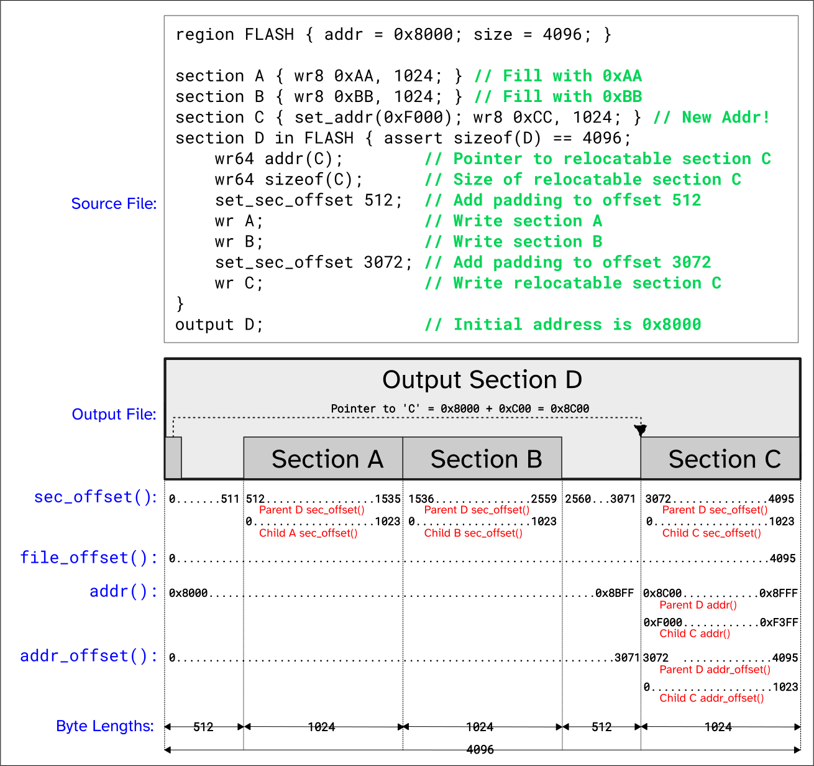

# Brink

Brink is a domain specific language for linking and composing of an output file.
Brink simplifies construction of complex files by managing sizes, offsets and
ordering in a readable declarative style.  Brink tries to be especially useful when
creating FLASH, ROM or other non-volatile memory images.

# Quick Start

## Build From Source

### Step 1: Install Rust

Brink is written in rust, which works on all major operating systems.  Installing rust is simple and documented in the [Rust Getting Started](https://www.rust-lang.org/learn/get-started) guide.

### Step 2: Clone Brink

From a command prompt, clone Brink and change directory to your clone.  For example:

    $ git clone https://github.com/steveking-gh/brink.git
    $ cd brink

### Step 3: Build and Run Self-Tests

    $ cargo test --release --all

All tests should pass, 0 tests should fail.

### Step 4: Install Brink

The previous build step created the Brink binary as `./target/release/brink`.  You can install the Brink binary anywhere on your system.  As a convenience, cargo provides a per-user installation as `$HOME/.cargo/bin/brink`.

    $ cargo install --path ./

# Command Line Options Reference

    brink [OPTIONS] <input>

The required input file contains the brink source code to compile and build the output file.  Brink source files typically have a .brink file extension.

| Option              | Description                                                                                                                       |
| ------------------- | --------------------------------------------------------------------------------------------------------------------------------- |
| `-D<name>[=value]`  | Defines a `const` value from the command line. See [Command-Line Const Defines](#command-line-const-defines) below.            |
| `--list-extensions` | List all available extensions compiled into brink as controlled by Cargo feature flags.                                           |
| `--map-csv`         | Writes a CSV format map file `<stem>.map.csv` to the current directory. For example: `firmware.brink` → `firmware.map.csv`.    |
| `--map-csv=<file>`  | Writes a CSV map file to the specified file.                                                                                      |
| `--map-csv=-`       | Writes a CSV map file to stdout.                                                                                                  |
| `--map-c99`         | Writes a C99 header file `<stem>.map.h` to the current directory. For example: `firmware.brink` → `firmware.map.h`.            |
| `--map-c99=<file>`  | Writes a C99 header to the specified file.                                                                                        |
| `--map-c99=-`       | Writes a C99 header to stdout.                                                                                                    |
| `--map-json`        | Writes a JSON format map file `<stem>.map.json` to the current directory. For example: `firmware.brink` → `firmware.map.json`. |
| `--map-json=<file>` | Writes a JSON map to the specified file.                                                                                          |
| `--map-json=-`      | Writes a JSON map to stdout.                                                                                                      |
| `--noprint`         | Suppress `print` statement output from the source program.                                                                        |
| `-o <file>`         | Output file name. Defaults to `output.bin`.                                                                                       |
| `-q`, `--quiet`     | Suppress all console output, including errors. Overrides `-v`. Useful for fuzz testing.                                           |
| `-v`                | Increase verbosity. Repeat up to four times (`-v -v -v -v`).                                                                      |

When the user does not specify a path, Brink writes map file(s) and the output to the current working directory.

## Command-Line Const Defines

The `-D` option injects a [`const`](#const-identifier--expr) definition into the program from the command line.
This option is modelled after the GCC `-D` preprocessor syntax.  You can specify `-D` multiple times, once per each definition.  For example:

    brink -DBASE=0x8000 -DCOUNT=16 firmware.brink

The `name` must be a valid Brink [identifier](#identifiers).  The `value` is optional; without a value, Brink sets the `const` to 1, with type `Integer`, following the GCC boolean-flag convention.

`-D` **overrides** any same-named `const` definition in the source.

Map output lists all `const` definitions including `-D` consts.

### Value Type Inference

Brink knows or infers the type from the value string using the same rules as source code for type inference.

| Example          | Value  | Type      | Description                                |
| ---------------- | ------ | --------- | ------------------------------------------ |
| `-DFLAG`         | 1      | `Integer` | Defaults to true (1).                      |
| `-DCOUNT=16`     | 16     | `Integer` | Plain decimal → `Integer`                  |
| `-DBASE=0x1000`  | 0x1000 | `U64`     | Hex/binary without suffix → implicit `U64` |
| `-DBASE=0x1000u` | 0x1000 | `U64`     | `u` suffix → explicit `U64`                |
| `-DOFFSET=0x40i` | 0x40   | `I64`     | `i` suffix → explicit `I64`                |
| `-DDELTA=-4`     | -4     | `I64`     | Negative decimal → implicit `I64`          |

### Example

Define a base address and section count at the command line:

    brink -DBASE=0x0800_0000 firmware.brink -o firmware.bin

The source can reference `BASE` as an ordinary const:

    section entry { wr8 0x01; }
    section top   { wr entry; }
    output top BASE;

---

# What Can Brink Do?

Brink can assemble any number of input files into a unified output.

---

Brink can calculate relative or absolute offsets, allowing the output to contain pointer tables, cross-references and so on.

---

Brink can add pad bytes to force parts of the file to be a certain size.

---

Brink can add pad bytes to force parts of the file to start at an aligned boundary or at an absolute location.

---

Brink can write your own strings and data defined within your Brink source file.

---

Brink provides full featured assert and print statement support to help with debugging complex output files.

---

## Hello World

For a source file called hello.brink:

    /*
     * A section defines part of an output.
     */
    section foo {
        // Print a quoted string to the console
        print "Hello World!\n";
    }

    // An output statement outputs the section to a file
    output foo;

Running Brink on the file produces the expected message:

    $ brink hello.brink
    Hello World!
    $

Brink also produced an empty file called `output.bin`.  This file is the default output when you don't specify some other name on the command line with the `-o` option.  Why is the file empty?  Because nothing in our program produced output file content -- we just printed the console message.

Let's fix that.  We can replace the `print` command with the `wrs` command, which is shorthand for 'write string':

    /*
     * A section defines part of an output.
     */
    section foo {
        // Write a quoted string to the output
        wrs "Hello World!\n";
    }

    // An output statement outputs the section to a file
    output foo;

Now, running the command again:

    $ brink hello.brink
    $

Produces output.bin containing the string `Hello World!\n`.

# Basic Structure of a Brink Program

A Brink source file consists of one or more section definitions and exactly one output statement.  Each section has a unique name.  The output statement specifies the name of the top level section.  Starting from the top section, Brink recursively evaluates each section and produces the output file.  For example, we can define a section with a write-string (wrs) expression:

    section foo {        // Start a new section named 'foo'
        wrs "I'm foo";   // wrs writes a string into the section.
    }

    output foo;          // Final output

Produces a default output named `output.bin`.

    $ cat output.bin
    I'm foo

Using a write (wr) statement, sections can write other sections:

    section foo {
        wrs "I'm foo\n";
    }

    section bar {
        wrs "I'm bar\n";
        wr foo;           // nested section
    }

    output bar;

Produces `output.bin`:

    $ cat output.bin
    I'm bar
    I'm foo

Users can extend Brink with custom data processing using [Brink Extension](#brink-extensions).  Users write the output of their extension call into a section with a `wr`.

    section foo {
        wrs "I'm foo\n";
    }

    section bar {
        wrs "I'm bar\n";
        wr foo;           // nested section
    }

    section final {
        wr bar;
        wr my_stuff::crc(bar);  // Write a 4 byte CRC hash for section 'bar'.
    }

    assert(sizeof(final) == 20);
    output final;

---

# Assert and Print

To aid in debug, Brink supports `assert` and `print` statements in your programs.

Assert expressions automate error checking.  This example verifies our expectation that section 'bar' is 13 bytes long.

    section bar {
        wrs "Hello World!\n";
        assert sizeof(bar) == 13;
    }
    output bar;

You can print this length information to the console during generation of your output:

    section bar {
        print "Output size is ", sizeof(bar), " bytes\n";
        wrs "Hello World!\n";
        assert sizeof(bar) == 13;
    }
    output bar;

Prints the console message:

    Output size is 13 bytes

---

# Addresses and Offsets

Unlike the [GNU linker 'ld'](https://ftp.gnu.org/old-gnu/Manuals/ld-2.9.1/html_mono/ld.html) concept of a *location counter*, Brink uses *scoped addresses* and *scoped offsets* to track locations.  **Addresses and offsets are 64-bit unsigned values that mark the position of the *next* byte of output**.  Brink allows users to reference and manipulate these values, adding pad bytes as necessary.

Importantly, addresses and offsets are *scoped* to their enclosing section.  When entering a nested (child) section, Brink saves the outer (parent) section's inflight address and offset values.  When exiting a child section, Brink restores and updates the parent's address and offset values.  From the perspective of the parent section, a child section is a `wr` with the parent's addresses and offsets updated per the size of the child.

For the specific case of the address and address offset, a child section inherits these values by default from the parent section.  If the child section does not use `set_addr`, then the address and address offset simply continue growing in step with the parent.

The only global (non-scoped) offset is the `file_offset`.  Starting from 0, this value monotonically increases to the end of the output file.

The following table provides a summary of the addresses and offsets used in Brink.

| Variable       | Section Entry | Section Exit     | [`set_addr`](set_addr-expression) | [`set_sec_offset`](set_sec_offset-expression--pad-byte-value) | [`set_addr_offset`](set_addr_offset-expression--pad-byte-value) | [`set_file_offset`](set_file_offset-expression--pad-byte-value) |
| -------------- | ------------- | ---------------- | --------------------------------- | ------------------------------------------------------------- | --------------------------------------------------------------- | --------------------------------------------------------------- |
| Address        | No Change     | Restore & Update | Set                               | Pad Forward                                                   | Pad Forward                                                     | Pad Forward                                                     |
| Address Offset | No Change     | Restore & Update | Set to 0                          | Pad Forward                                                   | Pad Forward                                                     | Pad Forward                                                     |
| Section Offset | Set to 0      | Restore & Update | No change                         | Pad Forward                                                   | Pad Forward                                                     | Pad Forward                                                     |
| File Offset    | No Change     | No Change        | No Change                         | Pad Forward                                                   | Pad Forward                                                     | Pad Forward                                                     |

The following diagram shows several address and offset concepts.  Users specify the starting logical address using an [output](#output-section-identifier-absolute-starting-address) statement.

<figure>
  
  <figcaption>In this example, section D is the top level binary output and includes three other sections A, B and C.  The user specified a starting address of 0x8000 in the <code>output</code> statement for this binary.  Section C is special and defines its own starting address.  A boot loader can find section C using the pointer at the beginning of the file, then copy section C to its proper starting address of 0xF000.  Notice that <code>addr(D)</code> used in the context of section D returns 0x8C00, not the starting address value 0xF000 nested within section C.
  </figcaption>
</figure>

## Brink Disallows Address Overwrites

By address, Brink tracks all bytes written to the output.  Brink reports an error if a program's offset or address manipulations cause more than one write to the same address.

## Brink Disallows Negative Offset Changes

Brink enforces that set offset commands must specify an offset change greater or equal to 0.  Brink emits pad bytes into the output for any offset change greater than 0.

## Brink Disallows Address and Offset Overflows

Brink emits an error if an address or offset change causes 64-bit unsigned overflow.  In other words, programs cannot use unsigned overflow wrapping back to 0.

# Order of Execution

As a mental model, user's can think of program execution as occurring in *output order*.  Output order means the sequence of operations that produce bytes in-order starting with the initial byte of the output file.  In other words, an operation producing the first byte of the output will execute before an operation producing the second byte.

Within a section definition, output order and source code order are the same.  However, outside of a section definition, output order and program order may differ.  For example, source code may define whole sections in a different order than instantiated into in the output.

## Output Creation Phases

This section provides an overview of Brink's internal output creation phases.

1. **Layout Phase**: First, Brink iteratively evaluates all expressions that affect output size and layout.  For example, Brink evaluates `align` expressions and extension `size()` calls during this phase.  On the other hand, Brink mostly skips statements like `wr64`, since knowing the result is 64-bits long is sufficient to determine the layout.  This phase completes when successive layout iterations produce identical results.
2. **Generate Phase 1**: Next, Brink begins populating data values into the output.  In this first generation phase, Brink first evaluates `wr` statements that do NOT call extensions.  Brink evaluates wr calls in output order.
3. **Generate Phase 2**: Next, Brink evaluates `wr` statement that call an [extension](#brink-extensions).  Like before, brink evaluates extension calls in output order.  Brink executes all extension calls serially on the engine thread.
4. **Validation Phase**: Finally, Brink evaluates `assert` statements, including those that call extensions.  Note that Brink may take an early exit in any phase if an `assert` statement will unambiguously fail.

---

# Brink Language Reference

## Comments

Brink supports C language line and block comments.

## Whitespace

Brink supports lenient C language style whitespace rules.

## Semicolon Termination

Like C language, statements must be terminated with a trailing semicolon character.

## Types

Brink supports the following data types:

* U64: 64-bit unsigned values
* I64: 64-bit signed values
* Integer: 64-bit integers with flexible sign treatment
* String: UTF-8 string in double quotes

Brink reports an error for under/overflow on arithmetic operations on U64, I64 and Integer types as described in [Arithmetic Operators](#arithmetic-operators).

## Identifiers

An identifier begins with a letter (A–Z, a–z) or an underscore (_), followed by zero or more letters, digits (0–9), or underscores.  Identifiers are case-sensitive.

Brink reserves certain identifiers and rejects their use as section names, const names, or label names at compile time.

Brink also reserves two identifier *prefixes*.  Any user defined identifier beginning with a reserved prefix triggers an error.

| Reserved Prefix | Reason                                                                                          |
| --------------- | ----------------------------------------------------------------------------------------------- |
| `wr` + digit    | Numeric write instructions (`wr8`, `wr16`, `wr32`, and future width variants)                   |
| `set_`          | Configuration directives (`set_sec_offset`, `set_addr`, `set_file_offset`, and future variants) |
| `__`            | Leading double underscore names refer to builtin identifiers.                                   |

Brink also reserves the following *exact* keywords:

| Reserved Keyword | Reason / possible future use  |
| ---------------- | ----------------------------- |
| `import`         | Module inclusion              |
| `if`             | Conditional section inclusion |
| `else`           | Conditional section inclusion |
| `true`           | Boolean literal               |
| `false`          | Boolean literal               |
| `extern`         | External section references   |
| `let`            | Variable declarations         |
| `fill`           | Fill / pad byte ranges        |

Keyword reservation is case-sensitive.  `Fill` and `FILL` are valid identifiers; `fill` is not.

---

## Literals

### Number Literals

Brink supports number literals in decimal, hex (0x) and binary (0b) forms.  After the first digit, you can use '_' within number literals to help with readability.  Brink uses the [parse_int](https://crates.io/crates/parse_int) library for conversion from string to value.

    assert 42 == 42;
    assert -42 == -42;
    assert 0x42 == 0x42;
    assert 0x42 == 66;
    assert 0x4_2 == 66;
    assert 0x42 == 6_6;

    assert 0b0 == 0;
    assert 0b01000010 == 0x42;
    assert 0b0100_0010 == 0x42;
    assert 0b101000010 == 0x142;
    assert 0b0000000001000010 == 0x42;

The following table summarizes how Brink determines the type of number literals.

| Example | Type    | Description                                                        |
| ------- | ------- | ------------------------------------------------------------------ |
| 4       | Integer | Simple decimal numbers are `Integer` type with flexible signedness |
| 4u      | U64     | Explicitly `U64`                                                   |
| 4i      | I64     | Explicitly `I64`                                                   |
| -4      | I64     | Negative numbers are `I64`                                         |
| 0x4     | U64     | Hex numbers are `U64` by default                                   |
| 0x4i    | I64     | Explicitly `I64` hex number                                        |
| 0b100   | U64     | Binary numbers are `U64` by default                                |

Brink does not support negative hex or binary literals.

For convenience, the compiler casts the flexible `Integer` type to `U64` or `I64` as needed.

    assert 42u == 42;  // U64 operates with Integer
    assert 42i == 42;  // I64 operates with Integer

Otherwise the types used in an expression must match.  For example:

    assert 42u == 42i; // mix unsigned and signed

Produces an error message:

    [EXEC_13] Error: Input operand types do not match.  Left is 'U64', right is 'I64'
       ╭─[tests/integers_5.brink:2:12]
       │
     2 │     assert 42u == 42i; // mix unsigned and signed
       ·            ^^^    ^^^
    ───╯

Users can explicitly cast a number literal or expression to the required signedness using the built-in `to_u64` to `to_i64` functions.  For example:

    assert -42 != to_i64(42);  // comparing signed to unsigned

The `to_u64` and `to_i64` functions **DO NOT** report an error if the runtime value under/overflows the destination type.

    assert 0xFFFF_FFFF_FFFF_FFFF == to_u64(-1); // OK
    assert to_i64(0xFFFF_FFFF_FFFF_FFFF) == -1; // OK

### True and False

Brink considers a zero value false and all non-zero values true.

### Quoted Strings

Brink allows utf-8 quoted strings with the following escape characters:
| Escape Character | UTF-8 Value | Name           |
| ---------------- | ----------- | -------------- |
| \\0              | 0x00        | Null           |
| \\t              | 0x09        | Horizontal Tab |
| \\n              | 0x0A        | Linefeed       |
| \\"              | 0x22        | Quotation Mark |

Newlines are Linux style, so "A\n" is a two byte string on all platforms.

## Arithmetic Operators

Brink supports the following arithmetic operators with same relative precedence as the Rust language.  Where applicable, Brink checks for arithmetic under/overflow.

| Precedence | Operator | Under/Overflow Check? | Description                                  |
| ---------- | -------- | ------------------------ | -------------------------------------------- |
| Highest    | (   )    | n/a                      | Paren grouping                               |
|            | *   /    | yes                      | Multiply and divide                          |
|            | +   -    | yes                      | Add and subtract                             |
|            | &        | n/a                      | Bitwise-AND                                  |
|            | \|       | n/a                      | Bitwise-OR                                   |
|            | <<  >>   | no                       | Bitwise shift up and down                    |
|            | ==  !=   | n/a                      | Equal and non-equal                          |
|            | >=  <=   | n/a                      | Greater-than-or-equal and less-than-or-equal |
|            | &&       | n/a                      | Logical-AND                                  |
| Lowest     | \|\|     | n/a                      | Logical-OR                                   |

---

## `addr( [identifier] ) -> U64`

When called with an identifier, returns the address of the identifier as a U64.  When called without an identifier, returns the current address.  See [Addresses and Offsets](#addresses-and-offsets) for more information.

The following table shows the scoping rules for `addr`.  To summarize, Brink tracks **exactly one address value** per name.  An `addr(<name>)` command retrieves that one value regardless of the scope of the caller.

| Command Form                  | Scope used to determine address                         |
| ----------------------------- | ------------------------------------------------------- |
| `addr()`                      | Scope of current section                                |
| `addr(<section name>)`        | Scope of parent section that contains the child section |
| `addr(<output section name)>` | Scope of the `output` section                           |
| `addr(<label name>)`          | Scope of the section that contains the label            |

Example:

    const BASE = 0x1000u;

    section fiz {
        assert addr() == BASE + 6;
        wrs "fiz";
        assert addr() == BASE + 9;
        assert addr(foo) == BASE;
    }

    section bar {
        assert addr() == BASE + 3;
        wrs "bar";
        assert addr() == BASE + 6;
        wr fiz;
        assert addr() == BASE + 9;
    }

    // top level section
    section foo {
        assert addr() == BASE;
        wrs "foo";
        assert addr() == BASE + 3;
        assert addr(fiz) == BASE + 6;
        wr bar;
        assert addr() == BASE + 9;
        assert addr(bar) == BASE + 3;
    }

    output foo BASE;  // starting address is BASE

---

## `align <expression> [, <pad byte value>];`

The align statement writes pad bytes into the current section until the absolute location counter reaches the specified alignment.  Align writes 0 as the default pad byte value, but the user may optionally specify a different value.

Example:

    section foo {
        wrs "Hello";
        align 32;
        assert sizeof(foo) == 32;
        assert addr() == 32;
    }

    output foo;

---

## `assert <expression>;`

The assert statement reports an error if the specified expression does not evaluate to a true (non-zero) value.  Assert expressions provide a means of error checking and do not affect the output file.

Example:

    section foo {
        assert 1;   // OK, non-zero is true
        assert -1;  // OK, non-zero is true
        assert 1 + 1 == 2;
    }

    output foo;

---

## `const <identifier> = <expr>;`

A const expression creates an immutable user defined identifier for a value.  The value can consist of a number or string literal, or an expression composed of other constants and literals.  Const identifier names have global scope and must be globally unique.  Const identifiers cannot conflict with any other global identifiers such as section names.

Example:

    const RAM_BASE = 0x8000_0000u;  // User defined unsigned constant.

    section foo {
        wr64 RAM_BASE;
        print "RAM base address is ", RAM_BASE, "\n";
    }

    output foo RAM_BASE;

Const expressions support the full set of arithmetic, bitwise and comparison operators.
Comparison operators evaluate to 1 (true) or 0 (false) and are useful for expressing
relationships between constants:

    const FLASH_BASE = 0x0800_0000u;
    const FLASH_SIZE = 0x0008_0000u;
    const RAM_BASE   = 0x2000_0000u;

    // Verify flash and RAM regions do not overlap
    const NO_OVERLAP = (FLASH_BASE + FLASH_SIZE) <= RAM_BASE;

    section foo {
        assert NO_OVERLAP;
    }

    output foo;

A const value expression cannot depend on addresses, sizes, offsets or any other dynamic aspect of the output file.  Brink resolves all const values before starting layout of the output.  For example:

    const RAM_BASE = 0x8000_0000u;        // OK, just a 64b unsigned literal.
    const RAM_SIZE = 32768;               // OK, just a 64b integer literal.
    const RAM_END = RAM_BASE + RAM_SIZE;  // OK, const composed of other consts.

    section foo {
        wrs "Hello\n";
    }

    const RAM_USED = sizeof(foo);         // ERROR!  Const cannot depend on section properties.

    output foo RAM_BASE;

---

## `addr_offset( [identifier] ) -> U64`

Returns the offset from the `output` or most recent `set_addr` anchor as a U64.  When called without an identifier, returns the current address offset.  When called with an identifier, returns the address offset at the start of the named section or label.

The offset resets to zero on each `set_addr` call.

The following table shows the scoping rules for `addr_offset`.  To summarize, Brink tracks **exactly one address offset value** per name.  An `addr_offset(<name>)` command retrieves that one value regardless of the scope of the caller.

| Command Form                         | Scope used to determine address                         |
| ------------------------------------ | ------------------------------------------------------- |
| `addr_offset()`                      | Scope of current section                                |
| `addr_offset(<section name>)`        | Scope of parent section that contains the child section |
| `addr_offset(<output section name)>` | Scope of the `output` section                           |
| `addr_offset(<label name>)`          | Scope of the section that contains the label            |

Example:

    const BASE = 0x1000u;

    section fiz {
        assert addr_offset() == 6;
        wrs "fiz";
        assert addr_offset() == 9;
        assert addr_offset(foo) == 0;
    }

    section bar {
        assert addr_offset() == 3;
        wrs "bar";
        assert addr_offset() == 6;
        wr fiz;
        assert addr_offset() == 9;
    }

    // top level section
    section foo {
        assert addr_offset() == 0;
        wrs "foo";
        assert addr_offset() == 3;
        assert addr_offset(fiz) == 6;
        wr bar;
        assert addr_offset() == 9;
        assert addr_offset(bar) == 3;
    }

    output foo BASE;  // starting address is BASE

---

## `include "<file>";`

Includes another Brink source file.  Brink processes the included file as if it were part of the current file.  For example, the included file can define sections, labels, constants and nested include files.

An included file may contain an output statement.  Brink will enforce that the entire program after include file resolution contains only one output statement.  See the [`output` statement](#output-section-identifier-absolute-starting-address) for more information.

The default path for an included file is the directory of the source file that contains the include statement.  For example, if `main.brink` is in `/home/user/project/` and contains `include "sections.brink"`, then Brink will look for `/home/user/project/sections.brink`.

Include files starting with a `/` are absolute paths.  Likewise, Brink supports relative paths such as `../`.

All paths use Linux style forward slashes.

Example:

    // file: main.brink
    include "../constants.brink";
    include "sections.brink";

    output main_rom 0x1000;

    // file: ../constants.brink
    const RAM_BASE = 0x8000_0000u;

    // file: sections.brink
    section main_rom {
        wrs "Hello\n";
    }

---

## Labels
Labels assign an identifier to a specific location in the output file.  Programs can then refer to the location of the label by name.  Labels names have global scope and label names must be globally unique.  Multiple different labels can refer to the same location.

Labels have the form `<label identifier>:` and can prefix most statement types.

For example:

    section foo {
        // assign the label 'lab1' to the current location
        lab1: wrs "Wow!";
        // assign the label 'lab2' to the current location
        lab2:
        assert addr(lab1) == 0x1000;
        assert addr(lab2) == 0x1004;
        assert addr(lab3) == 0x1004;
        // yet another label, same location as 'lab2'
        lab3:
    }

    output foo 0x1000;
---

## `output <section identifier> [absolute starting address];`

An output statement specifies the top section to write to the output file and an optional absolute starting address.  Without a starting address, `output` defaults to a starting address of 0.

**A Brink program must have exactly one output statement.**

An `include` file may contain an output statement.  Brink will enforce that the entire program after include file resolution contains only one output statement.

---
## `print <expression> [, <expression>, ...];`
The print statement evaluates the comma separated list of expressions and prints them to the console.  For expressions, print displays unsigned values in hex and signed values in decimal.  If needed, the `to_u64` and `to_i64` functions can control the output style.

Brink executes a given print statement for each instance found in the output file.  In other words, a print statement in a section written multiple times will execute multiple times in the order found.

Example:

    section bar {
        print "Section 'bar' starts at ", addr(), "\n";
        wrs "bar";
    }

    // top level section
    section foo {
        print "Output spans address range ", addr(foo), "-", addr(foo) + sizeof(foo),
              " (", to_i64(sizeof(foo)), " bytes)\n";
        wrs "foo";
        wr bar;
        wr bar;
        wr bar;
    }

    output foo 0x1000;  // starting address is 0x1000

Will result in the following console output:

    Output spans address range 0x1000-0x100C (12 bytes)
    Section 'bar' starts at 0x1003
    Section 'bar' starts at 0x1006
    Section 'bar' starts at 0x1009

---

## `sec_offset( [identifier] ) -> U64`

When called with an identifier, returns the unsigned 64-bit offset of the identifier from the start of the section that contains the identifier.  When called without an identifier, returns the offset from the start of the current section.

Example:

    section fiz {
        assert sec_offset() == 0;
        wrs "fiz";
        assert sec_offset() == 3;
    }

    section bar {
        assert sec_offset() == 0;
        wrs "bar";
        assert sec_offset() == 3;
        wr fiz;
        assert sec_offset() == 6;
        assert sec_offset(fiz) == 3;
    }

    const BASE = 0x1000u;

    // top level section
    section foo {
        assert sec_offset() == 0;
        wrs "foo";
        assert sec_offset() == 3;
        wr bar;
        assert sec_offset() == 9;
    }

    output foo BASE;  // starting address is BASE

When a section offset specifies an identifier, the identifier must be in the scope of the current section.  For example:

    section fiz {
        wrs "fiz";
    }

    section bar {
        wr fiz;
        assert sec_offset(fiz) == 0; // OK fiz in scope in section bar
    }

    section foo {
        wr bar;
        assert sec_offset(bar) == 0; // OK, bar is local in this section
        assert sec_offset(fiz) == 0; // ERROR, fiz is out of scope in section foo
    }

    output foo 0x1000;

---

## `section <name> { ... }`

A section is a named, reusable block of content.  Sections are the primary building block of a Brink program.  Each section defines a sequence of bytes, built up from write statements and location counter operations such as `align`.  Sections may also contain labels, assertions, print statements and so on.  Sections may write other sections into themselves so long as the nesting does not create a cycle.

Section names must be valid [identifiers](#identifiers), must be globally unique, and must not conflict with const names, label names, or [reserved identifiers](#reserved-identifiers).

Sections have their own section-relative location counter which resets to zero at the start of each section.  Sections can read and advance the section location counter with [`sec_offset()`](#sec-identifier----u64) and [`set_sec_offset()`](#set_sec_offset-expression--pad-byte-value) statements respectively.

The root section named in the [`output`](#output-section-identifier-absolute-starting-address) statement is the only section Brink writes to the output file.  Other sections can be directly or indirectly included via [`wr`](#wr-section-identifier) statements from the output section.  Unreachable sections produce a warning.

Example:

    section magic {
        wrs "FIRM";           // 4-byte magic number
        wr8 0x01;             // version
        assert sec_offset() == 5;    // Section location counter should be 5
    }

    section body {
        wr8 0xAA, 16;         // 16 bytes of payload
    }

    section image {
        wr magic;
        align 256;            // Body should start on 256 byte boundary
        wr body;
        assert sizeof(image) == 272;  // 256 + 16
    }

    output image 0x0800_0000u;

---

## `set_addr <expression>;`

The `set_addr` command forces the current address to the specified value and resets the current `addr_offset` to zero.  These changes happen within the scope of the containing section.  Child sections inherit the new `addr` and `addr_offset` values unless they call `set_addr` themselves.

Using `set_addr` *does not* change the value of the section offset nor file offset.  A `set_addr` command *does not* add pad bytes to the output.

The `set_addr` command may move the address forward or backwards.  However, Brink tracks every output byte by address and reports an error if a program tries to write to the same address more than once.

Example:

    section foo {
        wr8 1;
        wr8 2;
        wr8 3;
        wr8 4;
        wr8 5;
        set_addr 16;
        assert addr() == 16;
        assert addr_offset() = 0;   // set_addr resets addr_offset
        assert file_offset() == 5;  // set_addr does not pad
        assert sec_offset() == 5;
        wr8 0xAA, 3;
        assert addr_offset() = 3;
        assert file_offset() == 8;
        assert sec_offset() == 8;
        set_sec_offset 24, 0xFF;     // Adds 24 - 8 = 16 pad bytes
        assert addr() == 35;         // 19 + 16 = 35
        assert addr_offset() = 19;   // 3 + 16 = 19
        assert file_offset() == 24;  // 8 + 16 = 24
        assert sec_offset() == 24;   // 8 + 16 = 24
    }

    output foo;

---

## `set_addr_offset <expression> [, <pad byte value>];`

Pads the output until `addr_offset` reaches the specified value.  Users may specify an optional pad byte value or use the default value of 0.

If the specified value is less than the current `addr_offset`, Brink reports an error.

`set_addr_offset` is most useful after a `set_addr` call, because `set_addr` resets `addr_offset` to zero.  This lets users pad to a size relative to their chosen address anchor without knowing what the surrounding section's `sec_offset` happens to be.

Example:

    const BASE = 0x1000u;

    section header {
        wrs "FIRM";           // 4-byte magic number
        wr8 0x01;             // version byte
    }                         // addr_offset == 5 on exit

    section body {
        wr header;
        // Relocate body to its target load address.
        // addr_offset resets to 0.
        set_addr 0xF000u;
        wr8 0xAA, 3;          // 3 bytes of payload
        // Pad to 0x20 bytes from the 0xF000 anchor.
        set_addr_offset 0x20;
        assert addr() == 0xF020;
        assert addr_offset() == 0x20;
        assert sec_offset() == 0x25;  // 5 (header) + 3 (payload) + 29 (pad) = 0x25
    }

    output body BASE;

---

## `set_file_offset <expression> [, <pad byte value>];`
## `set_sec_offset <expression> [, <pad byte value>];`

The set_sec_offset and set_file_offset commands pad the output until the respective offset reaches the specified value.  Users may specify an optional pad byte value or use the default value of 0.

If the specified offset is less the current offset, Brink reports an error.

Example:

    section foo {
        wr8 1;
        wr8 2;
        wr8 3;
        wr8 4;
        wr8 5;
        set_sec_offset 16;
        assert addr() == 16;
        assert file_offset() == 16;
        assert sec_offset() == 16;
        wr8 0xAA, 3;
        set_sec_offset 24, 0xFF;
        assert addr() == 24;
        assert file_offset() == 24;
        assert sec_offset() == 24;
        set_sec_offset 24, 0xEE; // should do Nothing
        wr8 0xAA, 3;
        set_sec_offset 27, 0x33; // should do nothing
        set_sec_offset 28, 0x77; // should pad to 28
        assert sizeof(foo) == 28;
    }

    output foo;

---

## `sizeof( <identifier> ) -> U64`

Returns the size in bytes of the specified identifier.

Example:

    section empty_one {}
    section foo {
        wrs "Wow!";
        wr empty_one;
        assert sizeof(empty_one) == 0;
        assert sizeof(foo) == 4;
    }

    output foo;
---

## Built-in Variables

Brink pre-defines built-in identifiers that begin with `__` (double underscore).  They can appear in any expression context that accepts the corresponding type.  As shown in the table below, some builtins cannot be used in `const` expressions because their values depend on dynamic layout values.

| Variable                 | Type     | OK in `const`? | Description                                                              |
| ------------------------ | -------- | -------------- | ------------------------------------------------------------------------ |
| `__OUTPUT_SIZE`          | `U64`    | No             | Total output size in bytes.  Equivalent to `sizeof(<output-section>)`.   |
| `__OUTPUT_ADDR`          | `U64`    | No             | Starting address of the output.  Equivalent to `addr(<output-section>)`. |
| `__BRINK_VERSION_STRING` | `String` | Yes            | Brink version as a string, e.g. `"4.3.2"`.                               |
| `__BRINK_VERSION_MAJOR`  | `U64`    | Yes            | Major version component, e.g. "4" in "4.3.2"                             |
| `__BRINK_VERSION_MINOR`  | `U64`    | Yes            | Minor version component, e.g. "3" in "4.3.2"                             |
| `__BRINK_VERSION_PATCH`  | `U64`    | Yes            | Patch version component, e.g. "2" in "4.3.2"                             |

### `__OUTPUT_SIZE`

Returns the total size of the output file in bytes.

Example — write a 4-byte header field containing the total output size:

    section payload {
        wrs "Hello";
    }

    section hdr {
        wr32 __OUTPUT_SIZE;  // filled with total image size at link time
    }

    section image {
        wr hdr;
        wr payload;
        assert __OUTPUT_SIZE == sizeof(image);  // equivalent forms
    }

    output image;

### `__OUTPUT_ADDR`

Returns the absolute starting address of the output.  When the `output` statement specifies a base address, `__OUTPUT_ADDR` equals that address.  When `output` specifies no base address, `__OUTPUT_ADDR` is zero.  This behavior is identical to `addr(<output-section>)`.

Importantly, `__OUTPUT_ADDR` is fixed to the section start specified in the `output` statement, i.e. the entry point address, and does not “follow” an in-section `set_addr`.

Example — embed the output base address in a table without repeating the constant:

    section vtable {
        wr32 __OUTPUT_ADDR;  // base address of the output image
    }

    section code {
        wrs "code";
    }

    section image {
        wr vtable;
        wr code;
        assert __OUTPUT_ADDR == addr(image);  // equivalent forms
    }

    output image 0x0800_0000;

### `__BRINK_VERSION_STRING`

Returns the Brink tool version as a string (e.g. `"4.0.0"`).  The value is fixed at compile time and may be used in `const` expressions, `wrs`, and `print`.

Example — stamp the tool version into a firmware header:

    section hdr {
        wrs __BRINK_VERSION_STRING;
    }

    section image {
        wr hdr;
        wrs "payload";
    }

    output image;

### `__BRINK_VERSION_MAJOR`, `__BRINK_VERSION_MINOR`, `__BRINK_VERSION_PATCH`

Return the individual numeric components of the Brink version as `U64` values.  All three are fixed at compile time and may be used in `const` expressions and arithmetic.

Example — pack the version into a 3-byte field and assert the tool is new enough:

    const MIN_MAJOR = 4u;

    section hdr {
        assert __BRINK_VERSION_MAJOR >= MIN_MAJOR;
        wr8 __BRINK_VERSION_MAJOR;
        wr8 __BRINK_VERSION_MINOR;
        wr8 __BRINK_VERSION_PATCH;
    }

    section image {
        wr hdr;
        wrs "payload";
    }

    output image;

---

## `to_i64( <expression> ) -> I64`

Converts the specified expression to the I64 type without regard to under/overflow.

Example:

    section foo {
        assert to_i64(0xFFFF_FFFF_FFFF_FFFF) == -1;
        assert to_i64(42u) == 42;
        assert to_i64(42u) == 42i;
        assert to_i64(42) == 42i;
    }

    output foo;

---

## `to_u64( <expression> ) -> U64`

Converts the specified expression to the U64 type without regard to under/overflow.

Example:

    section foo {
        assert 0xFFFF_FFFF_FFFF_FFFF == to_u64(-1);
        assert to_u64(42i) == 42;
        assert to_u64(42i) == 42u;
        assert to_u64(42) == 42u;
    }

    output foo;

---

## `wr <section identifier>;`

Writes the contents of another section into the current section. Brink evaluates the referenced section and seamlessly copies its final output into the current location counter.

Using `wr`, you can build complex outputs by composing smaller, modular sections together.

Example:

    section header {
        wrs "FILE";
        wr8 0x01;
    }

    section data {
        wrs "DATA";
        wr8 0xFF, 4;
    }

    // Compose the top-level section
    section my_firmware {
        wr header;
        wr data;
    }

    output my_firmware;

---

## `wr <namespace>::<extension_name>(<arg1>, <arg2>, ...);`

Evaluates the specified extension call and writes the result to the output.  The extension's `.size()` method specifies the size of the result.

Example:

    section foo {
        wr custom::crc(start_label, end_label);
        assert sizeof(custom::crc) == 4;
    }

    output foo;

---

## `wr8 <expression> [, <expression>];`
## `wr16 <expression> [, <expression>];`
## `wr24 <expression> [, <expression>];`
## `wr32 <expression> [, <expression>];`
## `wr40 <expression> [, <expression>];`
## `wr48 <expression> [, <expression>];`
## `wr56 <expression> [, <expression>];`
## `wr64 <expression> [, <expression>];`

Evaluates the first expression and writes the result as a little-endian binary value to the output file.  Upper bits of the result value are silently truncated to the specified bit length.  The optional second expression specifies the repetition count.

Example:

    // Test expressions in wrx
    section foo {
        wr8  (1 + 2) + file_offset() + addr(foo) + sizeof(foo); // 3 + 0 + 10 + 36  = 49
        wr16 (1 + 2) + file_offset() + addr(foo) + sizeof(foo); // 3 + 1 + 10 + 36  = 50 00
        wr24 (1 + 2) + file_offset() + addr(foo) + sizeof(foo); // 3 + 3 + 10 + 36  = 52 00 00
        wr32 (1 + 2) + file_offset() + addr(foo) + sizeof(foo); // 3 + 6 + 10 + 36  = 55 00 00 00
        wr40 (1 + 2) + file_offset() + addr(foo) + sizeof(foo); // 3 + 10 + 10 + 36 = 59 00 00 00 00
        wr48 (1 + 2) + file_offset() + addr(foo) + sizeof(foo); // 3 + 15 + 10 + 36 = 64 00 00 00 00 00
        wr56 (1 + 2) + file_offset() + addr(foo) + sizeof(foo); // 3 + 21 + 10 + 36 = 70 00 00 00 00 00 00
        wr64 (1 + 2) + file_offset() + addr(foo) + sizeof(foo); // 3 + 28 + 10 + 36 = 77 00 00 00 00 00 00 00
        assert sizeof(foo) == 36;
    }

    output foo 10;

Another example using the optional repetition expression.

    section foo {
        wr32 0x12345678, 10; // write 0x12345678 10 times to the output file.
        wr8 0, addr() % 4096; // write zero enough times to align to 4KB boundary.
    }

---

## `wrf "<quoted file path>";`

Write the file at the specified path into the output file.  Brink treats all input files as binary files.  Paths can be relative to the current directory or absolute.

For example, given the file test_source_1.txt containing:

    Hello!

The following program simply copies these 6 UTF-8 characters to the output file.

    section foo {
        wrf "test_source_1.txt"; // Hello!
        assert sizeof(foo) == 6;
    }

    output foo;

---

## `wrs <expression> [, <expression>, ...];`

Evaluates the comma separated list of expressions and writes the resulting string to the output file.  Wrs accepts the same expressions and operates similarly to the print statement.  For more information, see [print](#print-expression--expression-).

The wrs statement does not implicitly write a terminating 0 byte after the string.  Users creating null terminated (C style) strings in an output file should add an explicit \0.

    wrs "my null terminated string\0";

---

# Brink Extensions

Brink supports compile time extensions to simplify the addition of new functionality.
This extension capability enables user defined hashing, compression, validation and other binary data processing tasks.  The following sections describe how extensions work and how to create them.

The command line option `--list-extensions` outputs the names of all available extensions as enabled by Cargo feature flags.

---

## Extensions Are A Compile-Time Feature

Extensions build and link to Brink at compile time as controlled by Cargo feature flags.  Because Rust does not guarantee a stable ABI between versions, Brink requires compile time construction to eliminate ABI incompatibilities and enable the use of safe Rust.  The following bullets provide an overview of how extensions work:

* Extensions interact with Brink through the `BrinkExtension` trait.

* Extensions can read directly from Brink's output buffer via zero-copy and safe-memory slices (`&[u8]`).  Brink allows some syntactic sugar to simplify the call site, but will always translate the specified memory range into a slice for the extension.

* In addition to output buffer access, extensions can have their own input parameters like a normal function call.

* Extensions are identified by a **name** in a **namespace**.  Brink reserves the namespaces `std` and `brink`.

* Extensions report their fixed length binary footprint by implementing the `.size()` trait method. Brink calls each extension's `.size()` method **exactly once** during output layout calculations and caches the result.  Brink always passes a mutable output slice (`&mut [u8]`) of the reported size to the extension's `.generate()` method.

* Extensions register themselves at compile time in Brink's internal extension registry.

* The `BrinkExtension` trait interface allows extensions to return logging and error diagnostics integrated with Brink's own diagnostic output.  See []

---

## Invoking Extensions

Users invoke extensions using function-style syntax.  For example, consider an extension named `crc` in a namespace called `custom`.  This `crc` extension takes two labels to define the start/end of the data section to hash and returns a 4-byte CRC value.

Users write the extension's result to the output using the generic `wr` command, for example `wr custom::crc(start_label, end_label);`.  Fixed-size write commands like `wr32` are invalid for extensions. If the designer needs to pad the extension's output to a specific size, they must follow the `wr` command with a `set_sec_offset` or `align` statement.

Users can query the size of an extension's output using the `sizeof` operator. For example, `assert sizeof(custom::crc) == 4;`.

## Ranged and Nonranged Extensions

Extensions have two possible forms: *ranged* and *nonranged*. A ranged extension takes an immutable slice of the output buffer as an additional input parameter.  This allows a ranged extension to produce a result based on output data, such as a CRC extension hashing a range of bytes.  Brink invokes ranged extensions even when the specified input range is empty.  Extensions that require non-empty input should return an error in that case.

---

## Creating and Registering a New Extension

Extensions register through the `extensions` crate (`extensions/src/lib.rs`).
`process.rs` calls `extensions::register_all` once at startup; adding an
extension requires no changes outside `extensions/`.

### Step 1 — Create the extension crate

Place new extensions under `std/` for standard library extensions, or under a
workspace path matching your namespace for third-party extensions.  Implement either
`BrinkExtension` (no image slice access) or `BrinkRangedExtension` (image slice
access) from the `brink_extension` crate.  Then, expose a `register` function:

    // my_extension/src/lib.rs
    use brink_extension::BrinkRangedExtension;
    use ext::ExtensionRegistry;

    pub struct MyExtension;

    impl BrinkRangedExtension for MyExtension {
        fn name(&self) -> &str { "my_ns::my_ext" }
        fn size(&self) -> usize { 4 }
        fn execute(&self, _args: &[u64], img: &[u8], out: &mut [u8]) -> Result<(), String> {
            // write 4 bytes into out
            Ok(())
        }
    }

    pub fn register(registry: &mut ExtensionRegistry) {
        registry.register_ranged(Box::new(MyExtension));
    }

### Step 2 — Add the crate to the workspace

In the root `Cargo.toml`, add the crate path to `[workspace] members`.

### Step 3 — Wire into `extensions/`

In `extensions/Cargo.toml`, add the new crate as a dependency:

    my_extension = { path = "../my_extension" }

In `extensions/src/lib.rs`, call its register function inside `register_all`:

    pub fn register_all(registry: &mut ExtensionRegistry) {
        std_crc32c::register(registry);
        my_extension::register(registry);  // add this line
    }

### Step 4 — Add tests

Create a `tests/` directory in your extension crate with `.brink` scripts
and an `integration.rs` test file.  Use `CARGO_MANIFEST_DIR` to locate
`.brink` files relative to the workspace root — see
`std/crc32c/tests/integration.rs` for a complete example.

Run the extension's tests with:

    cargo test -p my_extension

---

# Brink Development

This section provides notes for developers interested in contributing to Brink.

## Unit Testing

Brink relies on 100's of unit tests to catch bugs.  You can run these with:

    cargo test --all

## Fuzz Testing

Brink supports fuzz tests for several of its internal libraries.  Fuzz testing starts from
a corpus of random inputs and then further randomizes those inputs to try to
cause crashes and hangs.  At the time of writing, fuzz testing
**requires the nightly build**.  See `fuzz_help.txt` in the source repo for more information.

## Brink Source Code Overview

| File                   | Stage         | Summary                                                                     |
| ---------------------- | ------------- | --------------------------------------------------------------------------- |
| ast/ast.rs             | Stage 1       | Logos lexer → token stream → arena AST → AstDb validation                   |
| lineardb/lineardb.rs   | Stage 2       | AST flattening into linear IR and operand vectors; values are still strings |
| irdb/irdb.rs           | Stage 3       | String to typed value conversion, operand and file validation               |
| engine/engine.rs       | Stage 4       | Layout iteration loop, then execute pass to write binary output             |
| ir/ir.rs               | Shared types  | IRKind, ParameterValue, IROperand, IR — the data flowing between stages 2–4 |
| map/map.rs             | Map output    | Constructs MapDb and renders human-friendly map text                        |
| process/process.rs     | Orchestrator  | Orchestration of all stages, parses `-D` defines, opens the output file     |
| diags/diags.rs         | Cross-cutting | Ariadne-backed diagnostic output channel used by every stage                |
| extensions/src/lib.rs  | Extensions    | Single registration point for all extensions                                |
| brink_extension/lib.rs | Extensions    | Public API for extension authors                                            |
| ext/ext.rs             | Extensions    | Runtime extension registry and dispatch wrapper                             |
| std/crc32c/src/lib.rs  | std extension | CRC-32C (Castagnoli) hash over caller-specified output region               |

