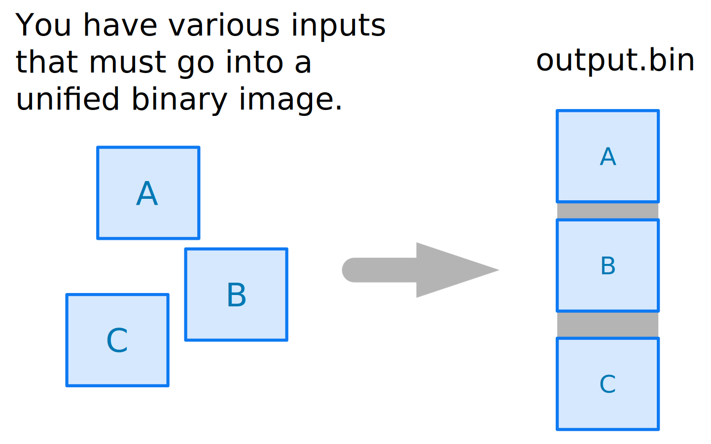
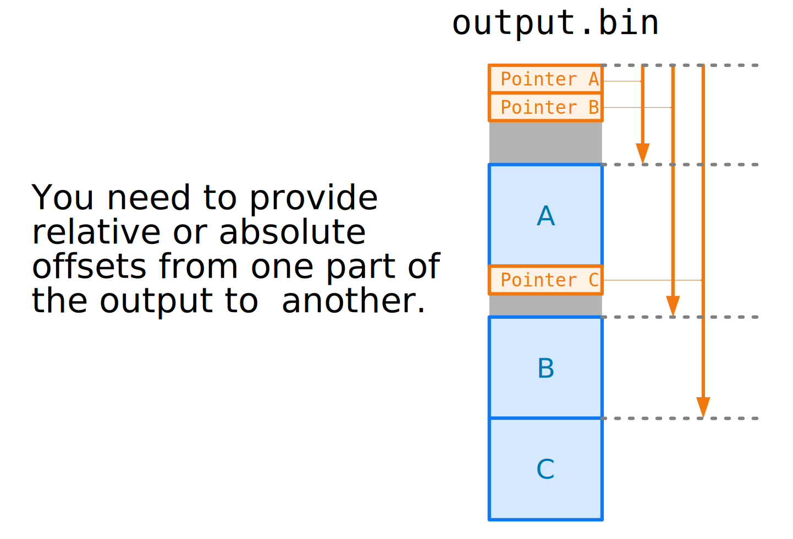
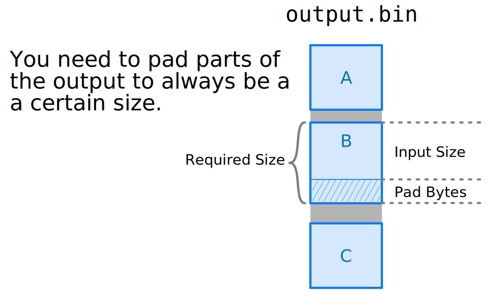
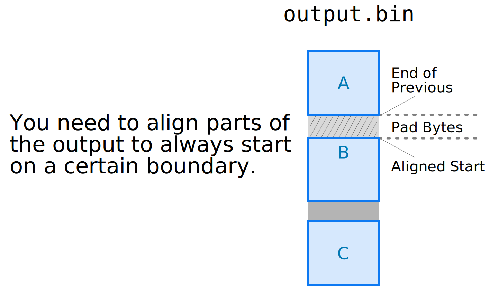
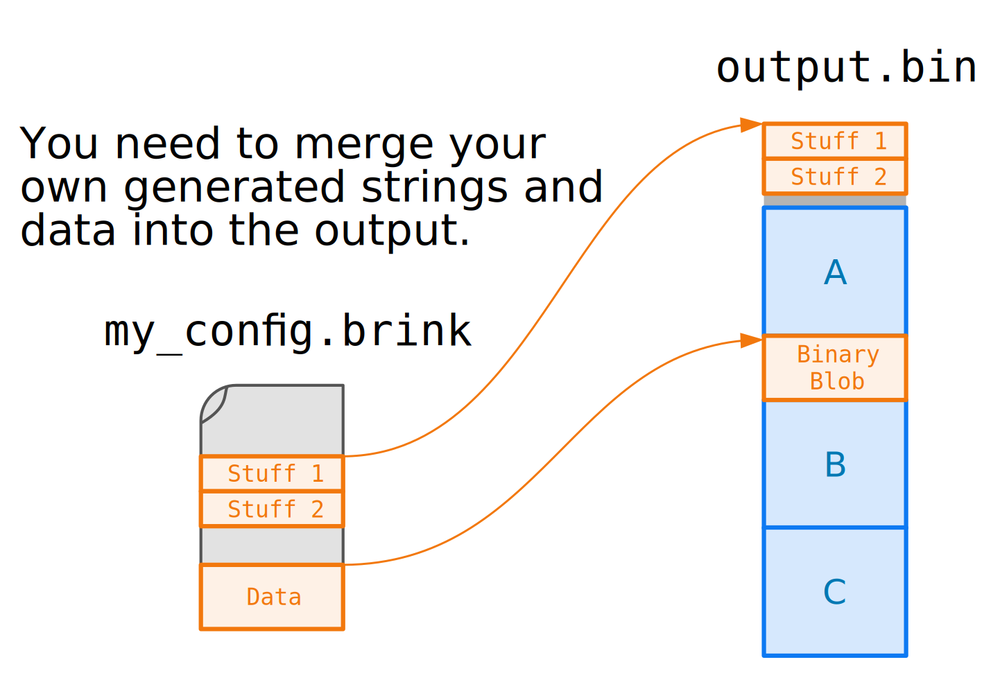
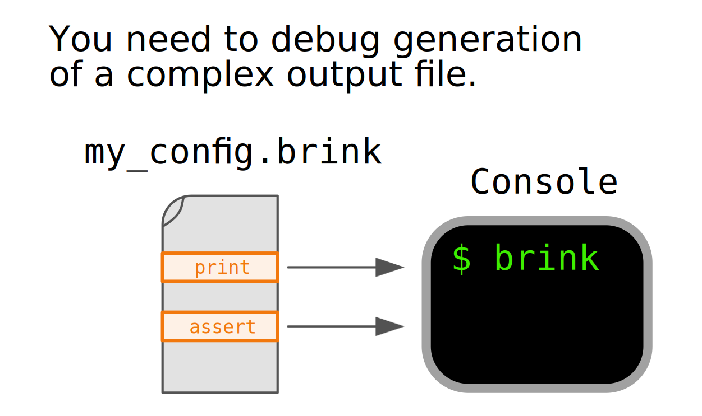
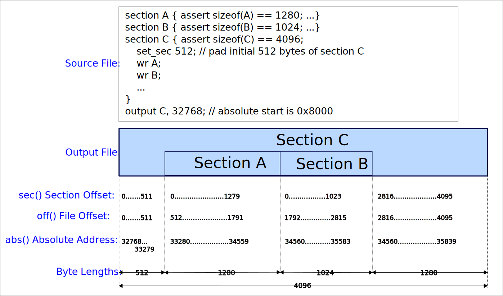

[](https://github.com/steveking-gh/brink/actions/workflows/rust.yml)

# Brink

Brink is a domain specific language for linking and composing of an output file.
Brink simplifies construction of complex files by managing sizes, offsets and
ordering in a readable declarative style.  Brink was created with FLASH or other
NVM images in mind, especially for use in embedded systems.

# Quick Start

## Build From Source

### Step 1: Install Rust

Brink is written in rust, which works on all major operating systems.  Installing rust is simple and documented in the [Rust Getting Started](https://www.rust-lang.org/learn/get-started) guide.

### Step 2: Clone Brink

From a command prompt, clone Brink and change directory to your clone.  For example:

    $ git clone https://github.com/steveking-gh/brink.git
    $ cd brink

### Step 3: Build and Run Self-Tests

    $ cargo test --release

All tests should pass, 0 tests should fail.

### Step 4: Install Brink

The previous build step created the Brink binary as `./target/release/brink`.  You can install the Brink binary anywhere on your system.  As a convenience, cargo provides a per-user installation as `$HOME/.cargo/bin/brink`.

    $ cargo install --path ./

# Command Line Options

    brink [OPTIONS] <input>

| Option              | Description                                                                                                                       |
| ------------------- | --------------------------------------------------------------------------------------------------------------------------------- |
| `<input>`           | Brink source file to compile (required).                                                                                          |
| `-o <file>`         | Output binary file name. Defaults to `output.bin`.                                                                                |
| `-v`                | Increase verbosity. Repeat up to four times (`-v -v -v -v`).                                                                      |
| `-q`, `--quiet`     | Suppress all console output, including errors. Overrides `-v`. Useful for fuzz testing.                                           |
| `--noprint`         | Suppress `print` statement output from the source program.                                                                        |
| `-D<NAME>[=VALUE]`  | Define a const value from the command line. May be repeated. See [Command-Line Const Defines](#command-line-const-defines) below. |
| `--list-extensions` | List all available extensions compiled into brink as controlled by Cargo feature flags.                                           |
| `--map-hf[=FILE]`   | Write a human-friendly map file. See [Map File Output](#map-file-output) below.                                                   |
| `--map-json[=FILE]` | Write a JSON map file. See [Map File Output](#map-file-output) below.                                                             |

## Map File Output

Both map options list every section, label, and constant with its address and size.  Both accept the same FILE argument forms:

| Invocation          | Result                                                                                                                            |
| ------------------- | --------------------------------------------------------------------------------------------------------------------------------- |
| `--map-csv`         | Writes a CSV format map file `<stem>.map.csv` to the current directory.<br>For example: `firmware.brink` → `firmware.map.csv`.    |
| `--map-csv=<file>`  | Writes a CSV map file to the specified file.                                                                                      |
| `--map-csv=-`       | Writes a CSV map file to stdout.                                                                                                  |
| `--map-c99`         | Writes a C99 header file `<stem>.map.h` to the current directory.<br>For example: `firmware.brink` → `firmware.map.h`.            |
| `--map-c99=<file>`  | Writes a C99 header to the specified file.                                                                                        |
| `--map-c99=-`       | Writes a C99 header to stdout.                                                                                                    |
| `--map-json`        | Writes a JSON format map file `<stem>.map.json` to the current directory.<br>For example: `firmware.brink` → `firmware.map.json`. |
| `--map-json=<file>` | Writes a JSON map to the specified file.                                                                                          |
| `--map-json=-`      | Writes a JSON map to stdout.                                                                                                      |

Brink writes map output to the current working directory when no path is given, keeping build artifacts out of source directories.  Both formats report the same semantic payload and both flags may be specified together.

### CSV Format Maps (`--map-csv`)

Produces a comma-separated, fixed-column CSV file that imports directly into a spreadsheet.

Example:

    Output File, output.bin
    Base Address, 0x0000000000001000
    Total Size (hex), 0x0000000000000050
    Total Size (decimal), 80

    Constants
    Name,            Value,
    BASE,            0x0000000000001000,

    Sections
    Name,            Address,             Offset,              File Offset,         Size (bytes),
    text,            0x0000000000001000,  0x0000000000000000,  0x0000000000000000,  0x00000032,

    Labels
    Name,            Address,             Offset,              File Offset,
    start,           0x0000000000001000,  0x0000000000000000,  0x0000000000000000,

### JSON Format Maps (`--map-json`)

Produces a pretty-printed JSON file.  Addresses and offsets are hex strings; sizes are plain numbers.

Example:

    {
      "output_file": "output.bin",
      "base_addr": "0x0000000000001000",
      "total_size": 80,
      "constants": [
        { "name": "BASE", "value": "0x0000000000001000" }
      ],
      "sections": [
        { "name": "text", "address": "0x0000000000001000",
          "offset": "0x0000000000000000", "file_offset": "0x0000000000000000", "size": 50 }
      ],
      "labels": [
        { "name": "start", "address": "0x0000000000001000",
          "offset": "0x0000000000000000", "file_offset": "0x0000000000000000" }
      ]
    }

### C99 Header Format Maps (`--map-c99`)

Produces a C preprocessor (C99 compatible) header file.  The header file is named `<stem>.map.h` where `<stem>` is the stem of the input file name.

Example:

```c
// !!!!!!!!!!!!!!!!!!!!!!!!!!!!!!!!!!!!!!!!!!
// Automatically generated file! Do not edit!
// !!!!!!!!!!!!!!!!!!!!!!!!!!!!!!!!!!!!!!!!!!
#ifndef OUTPUT_MAP_H
#define OUTPUT_MAP_H

#define OUTPUT_MAP_BASE_ADDR 0x0000000000001000ULL
#define OUTPUT_MAP_TOTAL_SIZE 80ULL

// Sections
#define OUTPUT_MAP_TEXT_ADDR 0x0000000000001000ULL
#define OUTPUT_MAP_TEXT_OFFSET 0x0000000000000000ULL
#define OUTPUT_MAP_TEXT_FILE_OFFSET 0x0000000000000000ULL
#define OUTPUT_MAP_TEXT_SIZE 50ULL

// Labels
#define OUTPUT_MAP_START_ADDR 0x0000000000001000ULL
#define OUTPUT_MAP_START_OFFSET 0x0000000000000000ULL
#define OUTPUT_MAP_START_FILE_OFFSET 0x0000000000000000ULL

#endif
```

## Command-Line Const Defines

The `-D` option injects a const into the program from the command line, matching the GCC `-D` preprocessor syntax.  Specify `-D` once per each const definition.

    brink -DBASE=0x8000 -DCOUNT=16 firmware.brink

Brink resolves a `-D` name everywhere a source `const` resolves — in expressions, `output` addresses, `assert` statements, and so on.  `-D` **overrides** any same-named `const` in the source.

Both map formats (`--map-hf` and `--map-json`) list `-D` consts alongside source consts.

### Syntax

    -D<NAME>
    -D<NAME>=<VALUE>

`NAME` must be a valid Brink identifier.  `VALUE` is optional; without a value, Brink sets the const to `Integer(1)`, following the GCC boolean-flag convention.

### Value Type Inference

Brink infers the type from the value string, matching source const rules.

| Example          | Value  | Type      | Description                             |
| ---------------- | ------ | --------- | --------------------------------------- |
| `-DFLAG`         | 1      | `Integer` | Defaults to true (1).                   |
| `-DCOUNT=16`     | 16     | `Integer` | Plain decimal → `Integer`               |
| `-DBASE=0x1000`  | 0x1000 | `U64`     | Hex/binary/octal without suffix → `U64` |
| `-DBASE=0x1000u` | 0x1000 | `U64`     | `u` suffix → `U64` (explicit)           |
| `-DOFFSET=0x40i` | 0x40   | `I64`     | `i` suffix → `I64`                      |
| `-DDELTA=-4`     | -4     | `I64`     | Negative decimal → `I64`                |

### Examples

Define a base address and section count at the command line:

    brink -DBASE=0x0800_0000 firmware.brink -o firmware.bin

The source can reference `BASE` as an ordinary const:

    section entry { wr8 0x01; }
    section top   { wr entry; }
    output top BASE;

---

# What Can Brink Do?

Brink can assemble any number of input files into a unified output.



---

Brink can calculate relative or absolute offsets, allowing the output to contain pointer tables, cross-references and so on.



---

Brink can add pad bytes to force parts of the file to be a certain size.



---

Brink can add pad bytes to force parts of the file to start at an aligned boundary or at an absolute location.



---

Brink can write your own strings and data defined within your Brink source file.



---

Brink provides full featured assert and print statement support to help with debugging complex output files.



---

## Hello World

For a source file called hello.brink:

    /*
     * A section defines part of an output.
     */
    section foo {
        // Print a quoted string to the console
        print "Hello World!\n";
    }

    // An output statement outputs the section to a file
    output foo;

Running Brink on the file produces the expected message:

    $ brink hello.brink
    Hello World!
    $

Brink also produced an empty file called `output.bin`.  This file is the default output when you don't specify some other name on the command line with the `-o` option.  Why is the file empty?  Because nothing in our program produced output file content -- we just printed the console message.

Let's fix that.  We can replace the `print` command with the `wrs` command, which is shorthand for 'write string':

    /*
     * A section defines part of an output.
     */
    section foo {
        // Write a quoted string to the output
        wrs "Hello World!\n";
    }

    // An output statement outputs the section to a file
    output foo;

Now, running the command again:

    $ brink hello.brink
    $

Produces output.bin containing the string `Hello World!\n`.

## Assertions

Brink supports assert expressions for error checking.  This example verifies that the size of the section 'bar' is 13 bytes long.

    section bar {
        wrs "Hello World!\n";
        assert sizeof(bar) == 13;
    }
    output bar;

To aid in debug, you can of course print this length information to the console during generation of your output:

    section bar {
        print "Output size is ", sizeof(bar), " bytes\n";
        wrs "Hello World!\n";
        assert sizeof(bar) == 13;
    }
    output bar;

Prints the console message:

    Output size is 13 bytes

In addition to writing to 'output.bin'.

# The Location Counter

Like the [GNU linker 'ld'](https://ftp.gnu.org/old-gnu/Manuals/ld-2.9.1/html_mono/ld.html), Brink uses the concept of a *location counter*.  The location counter is the current position in the output file, referenced from either the start of the current section, the start of the entire output image or the absolute logical address.  **The location counter can only move forward.**

The following diagram shows the basic concepts.  Users specify the starting logical address using an [output](#output-section-identifier-absolute-starting-address) statement.



Programs can query the location counter using the [abs](#abs-identifier----u64), [off](#off-identifier----u64) and [sec](#sec-identifier----u64) statements.  Programs force the location counter forward to a specific offset or address using the [set_sec](#set_sec-expression--pad-byte-value), [set_off](#set_off-expression--pad-byte-value) and [set_abs](#set_abs-expression--pad-byte-value) statements.  Brink reports an error if any set operation would cause the location counter to move backwards.  `set_abs` is the exception: it rebases the absolute anchor without moving forward or requiring a forward-only target.

## Unit Testing

Brink supports unit tests.

    cargo test

## Fuzz Testing

Brink supports fuzz tests for its various submodules.  Fuzz testing starts from
a corpus of random inputs and then further randomizes those inputs to try to
cause crashes and hangs.  At the time of writing (Rust 1.51.0), fuzz testing
**requires the nightly build**.

To run fuzz tests:

    $ cd process
    $ cargo +nightly fuzz run fuzz_target_1

    $ cd lineardb
    $ cargo +nightly fuzz run fuzz_target_1

    $ cd ast
    $ cargo +nightly fuzz run fuzz_target_1

Fuzz tests run until stopped with Ctrl-C.  In my experience, fuzz tests will catch a problem in 60 seconds or not at all.

Cargo fuzz uses LLVM's libFuzzer internally, which provides a vast array of runtime options.  To see thh options using the nightly compiler build:

    cargo +nightly fuzz run fuzz_target_1 -- -help=1

A copy of this help output is in the fuzz_help.txt file.

For example, setting a smaller 5 second timeout for hangs and maximum input length of 256 bytes.

    cargo +nightly fuzz run fuzz_target_1 -- -timeout=5 -max_len=256

# Basic Structure of a Brink Program

A Brink source file consists of one or more section definitions and exactly one output statement.    Each section has a unique name.  The output statement specifies the name of the top level section.  Starting from the top section, Brink recursively evaluates each section and produces the output file.  For example, we can define a section with a write-string (wrs) expression:

    section foo {
        wrs "I'm foo";
    }

    output foo;

Produces a default output named `output.bin`.

    $ cat output.bin
    I'm foo


Using a write (wr) statement, sections can write other sections:

    section foo {
        wrs "I'm foo\n";
    }

    section bar {
        wrs "I'm bar\n";
        wr foo;
    }

    output bar;

Produces `output.bin`:

    $ cat output.bin
    I'm bar
    I'm foo

---

# Brink Language Reference

## Comments

Brink supports C language line and block comments.

## Whitespace

Brink supports lenient C language style whitespace rules.

## Semicolon Termination

Like C language, statements must be terminated with a trailing semicolon character.

## Types

Brink supports the following data types:

* `U64` - 64-bit unsigned values
* `I64` - 64-bit signed values
* `Integer` - 64-bit with flexible sign treatment
* `QuotedString` - A UTF-8 string in double quotes
* `Identifier` - Identifier names

## Reserved Identifiers

Brink reserves certain identifiers and rejects their use as section names, const names, or label names at compile time.

Brink reserves two identifier *prefixes*.  Any identifier beginning with a reserved prefix triggers an error, regardless of the suffix:

| Reserved Prefix | Reason                                                                          |
| --------------- | ------------------------------------------------------------------------------- |
| `wr`            | Write instructions (`wr8`, `wr16`, `wrs`, `wrf`, and future variants)           |
| `set_`          | Configuration directives (`set_sec`, `set_off`, `set_abs`, and future variants) |

Brink also reserves the following *exact* keywords for future language features:

| Reserved Keyword | Possible future use           |
| ---------------- | ----------------------------- |
| `import`         | Module inclusion              |
| `if`             | Conditional section inclusion |
| `else`           | Conditional section inclusion |
| `true`           | Boolean literal               |
| `false`          | Boolean literal               |
| `extern`         | External section references   |
| `let`            | Variable declarations         |
| `fill`           | Fill / pad byte ranges        |

Keyword reservation is case-sensitive.  `Fill` and `FILL` are valid identifiers; `fill` is not.

---

## Literals

### Number Literals

Brink supports number literals in decimal, hex (0x) and binary (0b) forms.  After the first digit, you can use '_' within number literals to help with readability.  Brink uses the [parse_int](https://crates.io/crates/parse_int) library for conversion from string to value.

    assert 42 == 42;
    assert -42 == -42;
    assert 0x42 == 0x42;
    assert 0x42 == 66;
    assert 0x4_2 == 66;
    assert 0x42 == 6_6;

    assert 0b0 == 0;
    assert 0b01000010 == 0x42;
    assert 0b0100_0010 == 0x42;
    assert 0b101000010 == 0x142;
    assert 0b0000000001000010 == 0x42;

The following table summarizes how Brink determines the type of number literals.

| Example | Type    | Description                                                        |
| ------- | ------- | ------------------------------------------------------------------ |
| 4       | Integer | Simple decimal numbers are `Integer` type with flexible signedness |
| 4u      | U64     | Explicitly `U64`                                                   |
| 4i      | I64     | Explicitly `I64`                                                   |
| -4      | I64     | Negative numbers are `I64`                                         |
| 0x4     | U64     | Hex numbers are `U64` by default                                   |
| 0x4i    | I64     | Explicitly `I64` hex number                                        |
| 0b100   | U64     | Binary numbers are `U64` by default                                |

For convenience, the compiler casts the flexible `Integer` type to `U64` or `I64` as needed.

    assert 42u == 42;  // U64 operates with Integer
    assert 42i == 42;  // I64 operates with Integer

Otherwise the types used in an expression must match.  For example:

    assert 42u == 42i; // mix unsigned and signed

Produces an error message:

    [EXEC_13] Error: Input operand types do not match.  Left is 'U64', right is 'I64'
       ╭─[tests/integers_5.brink:2:12]
       │
     2 │     assert 42u == 42i; // mix unsigned and signed
       ·            ^^^    ^^^
    ───╯

Users can explicitly cast a number literal or expression to the required signedness using the built-in `to_u64` to `to_i64` functions.  For example:

    assert -42 != to_i64(42);  // comparing signed to unsigned

The `to_u64` and `to_i64` functions **DO NOT** report an error if the runtime value under/overflows the destination type.

    assert 0xFFFF_FFFF_FFFF_FFFF == to_u64(-1); // OK
    assert to_i64(0xFFFF_FFFF_FFFF_FFFF) == -1; // OK

### True and False

Brink considers a zero value false and all non-zero values true.

### Quoted Strings

Brink allows utf-8 quoted strings with the following escape characters:
| Escape Character | UTF-8 Value | Name           |
| ---------------- | ----------- | -------------- |
| \\0              | 0x00        | Null           |
| \\t              | 0x09        | Horizontal Tab |
| \\n              | 0x0A        | Linefeed       |
| \\"              | 0x22        | Quotation Mark |

Newlines are Linux style, so "A\n" is a two byte string on all platforms.

## Arithmetic Operators

Brink supports the following arithmetic operators with same relative precedence as the Rust language.

| Precedence | Operator | Under/Overflow Check? | Description                                  |
| ---------- | -------- | --------------------- | -------------------------------------------- |
| Highest    | (   )    | n/a                   | Paren grouping                               |
|            | *   /    | yes                   | Multiply and divide                          |
|            | +   -    | yes                   | Add and subtract                             |
|            | &        | n/a                   | Bitwise-AND                                  |
|            | \|       | n/a                   | Bitwise-OR                                   |
|            | <<  >>   | no                    | Bitwise shift up and down                    |
|            | ==  !=   | n/a                   | Equals and non-equal                         |
|            | >=  <=   | n/a                   | Greater-than-or-equal and less-than-or-equal |
|            | &&       | n/a                   | Logical-AND                                  |
| Lowest     | \|\|     | n/a                   | Logical-OR                                   |
---

As shown in the table, Brink will check some operations for arithmetic under/overflow.

---

## `abs( [identifier] ) -> U64`

When called with an identifier, returns the absolute byte address of the identifier as a U64.  When called without an identifier, returns the current absolute address.  The absolute byte address is the image offset + the starting address specified in the `output` statement.

Example:

    const BASE = 0x1000u;

    section fiz {
        assert abs() == BASE + 6;
        wrs "fiz";
        assert abs() == BASE + 9;
        assert abs(foo) == BASE;
    }

    section bar {
        assert abs() == BASE + 3;
        wrs "bar";
        assert abs() == BASE + 6;
        wr fiz;
        assert abs() == BASE + 9;
    }

    // top level section
    section foo {
        assert abs() == BASE;
        wrs "foo";
        assert abs() == BASE + 3;
        assert abs(fiz) == BASE + 6;
        wr bar;
        assert abs() == BASE + 9;
        assert abs(bar) == BASE + 3;
    }

    output foo BASE;  // starting absolute address is BASE

---

## `align <expression> [, <pad byte value>];`

The align statement writes pad bytes into the current section until the absolute location counter reaches the specified alignment.  Align writes 0 as the default pad byte value, but the user may optionally specify a different value.

Example:

    section foo {
        wrs "Hello";
        align 32;
        assert sizeof(foo) == 32;
        assert abs() == 32;
    }

    output foo;

---

## `assert <expression>;`

The assert statement reports an error if the specified expression does not evaluate to a true (non-zero) value.  Assert expressions provide a means of error checking and do not affect the output file.

Example:

    section foo {
        assert 1;   // OK, non-zero is true
        assert -1;  // OK, non-zero is true
        assert 1 + 1 == 2;
    }

    output foo;

---

## `const <identifier> = <expr>;`

A const expression creates an immutable user defined identifier for a value.  The value can consist of a number or string literal, or an expression composed of other constants and literals.  Const identifiers have global scope and must be globally unique.  Const identifiers cannot conflict with
any other global identifiers such as section names.

Example:

    const RAM_BASE = 0x8000_0000u;  // User defined unsigned constant.

    section foo {
        wr64 RAM_BASE;
        print "RAM base address is ", RAM_BASE, "\n";
    }

    output foo RAM_BASE;


Const expressions support the full set of arithmetic, bitwise and comparison operators.
Comparison operators evaluate to 1 (true) or 0 (false) and are useful for expressing
relationships between constants:

    const FLASH_BASE = 0x0800_0000u;
    const FLASH_SIZE = 0x0008_0000u;
    const RAM_BASE   = 0x2000_0000u;

    // Verify flash and RAM regions do not overlap
    const NO_OVERLAP = (FLASH_BASE + FLASH_SIZE) <= RAM_BASE;

    section foo {
        assert NO_OVERLAP;
    }

    output foo;

A const value expression cannot depend on sizes or locations in the output file.  In other words, the Brink compiler resolves all const values before constructing the output image.  For example:

    const RAM_BASE = 0x8000_0000u;        // OK, just a 64b unsigned literal.
    const RAM_SIZE = 32768;               // OK, just a 64b integer literal.
    const RAM_END = RAM_BASE + RAM_SIZE;  // OK, const composed of other consts.

    section foo {
        wrs "Hello\n";
    }

    const RAM_USED = sizeof(foo);         // ERROR!  Const cannot depend on section properties.
    const FOO_START = abs(foo);           // ERROR!  Const cannot depend on section properties.

    output foo RAM_BASE;

---

## `off( [identifier] ) -> U64`

Returns the byte offset from the most recent `set_abs` anchor as a U64.  When called without an identifier, returns the current offset.  When called with an identifier, returns the offset at the start of the named section.  The offset resets to zero on each `set_abs` call.  Where no `set_abs` has been issued, the offset equals the file position from the start of the output image.

Example:

    const BASE = 0x1000u;

    section fiz {
        assert off() == 6;
        wrs "fiz";
        assert off() == 9;
        assert off(foo) == 0;
    }

    section bar {
        assert off() == 3;
        wrs "bar";
        assert off() == 6;
        wr fiz;
        assert off() == 9;
    }

    // top level section
    section foo {
        assert off() == 0;
        wrs "foo";
        assert off() == 3;
        assert off(fiz) == 6;
        wr bar;
        assert off() == 9;
        assert off(bar) == 3;
    }

    output foo BASE;  // starting absolute address is BASE

---

## `include "<file>";`

Includes another Brink source file.  Brink processes the included file as if it were part of the current file.  For example, the included file can define sections, labels, constants and nested include files.

An included file may contain an output statement.  Brink will enforce that the entire program after include file resolution contains only one output statement.  See the [`output` statement](#output-section-identifier-absolute-starting-address) for more information.

The default path for an included file is the directory of the source file that contains the include statement.  For example, if `main.brink` is in `/home/user/project/` and contains `include "sections.brink"`, then Brink will look for `/home/user/project/sections.brink`.

Include files starting with a `/` are absolute paths.  Likewise, Brink supports relative paths such as `../`.

All paths use Linux style forward slashes.

Example:

    // file: main.brink
    include "../constants.brink";
    include "sections.brink";

    output main_rom 0x1000;

    // file: ../constants.brink
    const RAM_BASE = 0x8000_0000u;

    // file: sections.brink
    section main_rom {
        wrs "Hello\n";
    }

---

## Labels
Labels assign an identifier to a specific location in the output file.  Other source code can then refer to the location of the label by name.  Labels have global scope and label names must be globally unique.  Multiple different labels can refer to the same location.

Labels have the form `<label identifier>:`

For example:

    section foo {
        // assign the label 'lab1' to the current location
        lab1: wrs "Wow!";
        // assign the label 'lab2' to the current location
        lab2:
        assert abs(lab1) == 0x1000;
        assert abs(lab2) == 0x1004;
        assert abs(lab3) == 0x1004;
        // yet another label, same location as 'lab2'
        lab3:
    }

    output foo 0x1000;
---

## `output <section identifier> [absolute starting address];`

An output statement specifies the top section to write to the output file and an optional absolute starting address.  Without a starting address, `output` defaults to a starting address of 0.

**A Brink program must have exactly one output statement.**

An `include` file may contain an output statement.  Brink will enforce that the entire program after include file resolution contains only one output statement.

---
## `print <expression> [, <expression>, ...];`
The print statement evaluates the comma separated list of expressions and prints them to the console.  For expressions, print displays unsigned values in hex and signed values in decimal.  If needed, the `to_u64` and `to_i64` functions can control the output style.

Brink executes a given print statement for each instance found in the output file.  In other words, a print statement in a section written multiple times will execute multiple times in the order found.

Example:

    section bar {
        print "Section 'bar' starts at ", abs(), "\n";
        wrs "bar";
    }

    // top level section
    section foo {
        print "Output spans address range ", abs(foo), "-", abs(foo) + sizeof(foo),
              " (", to_i64(sizeof(foo)), " bytes)\n";
        wrs "foo";
        wr bar;
        wr bar;
        wr bar;
    }

    output foo 0x1000;  // starting absolute address is 0x1000

Will result in the following console output:

    Output spans address range 0x1000-0x100C (12 bytes)
    Section 'bar' starts at 0x1003
    Section 'bar' starts at 0x1006
    Section 'bar' starts at 0x1009

---

## `sec( [identifier] ) -> U64`

When called with an identifier, returns the byte offset as a U64 of the identifier from the start of the current section.  When called without an identifier, returns the current section offset.

Example:

    section fiz {
        assert sec() == 0;
        wrs "fiz";
        assert sec() == 3;
    }

    section bar {
        assert sec() == 0;
        wrs "bar";
        assert sec() == 3;
        wr fiz;
        assert sec() == 6;
        assert sec(fiz) == 3;
    }

    const BASE = 0x1000u;

    // top level section
    section foo {
        assert sec() == 0;
        wrs "foo";
        assert sec() == 3;
        wr bar;
        assert sec() == 9;
    }

    output foo BASE;  // starting absolute address is BASE

When a section offset specifies an identifier, the identifier must be in the scope of the current section.  For example:

    section fiz {
        wrs "fiz";
    }

    section bar {
        wr fiz;
        assert sec(fiz) == 0; // OK fiz in scope in section bar
    }

    section foo {
        wr bar;
        assert sec(bar) == 0; // OK, bar is local in this section
        assert sec(fiz) == 0; // ERROR, fiz is out of scope in section foo
    }

    output foo 0x1000;

---

## `set_sec <expression> [, <pad byte value>];`
## `set_img <expression> [, <pad byte value>];`
## `set_abs <expression> [, <pad byte value>];`

The set_sec, set_img and set_abs statements pad the output until the respective location counter reaches the specified value.  Users may specify an optional pad byte value or use the default value of 0.

These statements may be used to pad sections or images to the specified length.

| Statement | Description                                                  |
| --------- | ------------------------------------------------------------ |
| set_sec   | Pads until the *section* offset reaches the specified value. |
| set_img   | Likewise for the *image* offset.                             |
| set_abs   | Likewise for the *absolute address*                          |

Note that these statements cannot cause the current location counter to move backwards.  If the specified value is less the corresponding location, Brink reports an error.

Example:

    section foo {
        wr8 1;
        wr8 2;
        wr8 3;
        wr8 4;
        wr8 5;
        set_sec 16;
        assert abs() == 16;
        assert img() == 16;
        assert sec() == 16;
        wr8 0xAA, 3;
        set_sec 24, 0xFF;
        assert abs() == 24;
        assert img() == 24;
        assert sec() == 24;
        set_sec 24, 0xEE; // should do Nothing
        wr8 0xAA, 3;
        set_sec 27, 0x33; // should do nothing
        set_sec 28, 0x77; // should pad to 28
        assert sizeof(foo) == 28;
    }

    output foo;

---

## `sizeof( <identifier> ) -> U64`

Returns the size in bytes of the specified identifier.

Example:

    section empty_one {}
    section foo {
        wrs "Wow!";
        wr empty_one;
        assert sizeof(empty_one) == 0;
        assert sizeof(foo) == 4;
    }

    output foo;
---

## `to_i64( <expression> ) -> I64`

Converts the specified expression to the I64 type without regard to under/overflow.

Example:

    section foo {
        assert to_i64(0xFFFF_FFFF_FFFF_FFFF) == -1;
        assert to_i64(42u) == 42;
        assert to_i64(42u) == 42i;
        assert to_i64(42) == 42i;
    }

    output foo;

---

## `to_u64( <expression> ) -> U64`

Converts the specified expression to the U64 type without regard to under/overflow.

Example:

    section foo {
        assert 0xFFFF_FFFF_FFFF_FFFF == to_u64(-1);
        assert to_u64(42i) == 42;
        assert to_u64(42i) == 42u;
        assert to_u64(42) == 42u;
    }

    output foo;

---

## `wr <section identifier>;`

Writes the contents of another section into the current section. Brink evaluates the referenced section and seamlessly copies its final output into the current location counter.

Using `wr`, you can build complex outputs by composing smaller, modular sections together.

Example:

    section header {
        wrs "FILE";
        wr8 0x01;
    }

    section data {
        wrs "DATA";
        wr8 0xFF, 4;
    }

    // Compose the top-level section
    section img {
        wr header;
        wr data;
    }

    output img;

---

## `wr <namespace>::<extension_name>(<arg1>, <arg2>, ...);`

Evaluates the specified extension call and writes the result to the output image.  The extension's `.size()` method specifies the number of bytes to write to the output image.

Example:

    section foo {
        wr custom::crc(start_label, end_label);
        assert sizeof(custom::crc) == 4;
    }

    output foo;

---

## `wr8 <expression> [, <expression>];`
## `wr16 <expression> [, <expression>];`
## `wr24 <expression> [, <expression>];`
## `wr32 <expression> [, <expression>];`
## `wr40 <expression> [, <expression>];`
## `wr48 <expression> [, <expression>];`
## `wr56 <expression> [, <expression>];`
## `wr64 <expression> [, <expression>];`

Evaluates the first expression and writes the result as a little-endian binary value to the output file.  Upper bits of the result value are silently truncated to the specified bit length.  The optional second expression specifies the repetition count.

Example:

    // Test expressions in wrx
    section foo {
        wr8  (1 + 2) + img() + abs(foo) + sizeof(foo); // 3 + 0 + 10 + 36  = 49
        wr16 (1 + 2) + img() + abs(foo) + sizeof(foo); // 3 + 1 + 10 + 36  = 50 00
        wr24 (1 + 2) + img() + abs(foo) + sizeof(foo); // 3 + 3 + 10 + 36  = 52 00 00
        wr32 (1 + 2) + img() + abs(foo) + sizeof(foo); // 3 + 6 + 10 + 36  = 55 00 00 00
        wr40 (1 + 2) + img() + abs(foo) + sizeof(foo); // 3 + 10 + 10 + 36 = 59 00 00 00 00
        wr48 (1 + 2) + img() + abs(foo) + sizeof(foo); // 3 + 15 + 10 + 36 = 64 00 00 00 00 00
        wr56 (1 + 2) + img() + abs(foo) + sizeof(foo); // 3 + 21 + 10 + 36 = 70 00 00 00 00 00 00
        wr64 (1 + 2) + img() + abs(foo) + sizeof(foo); // 3 + 28 + 10 + 36 = 77 00 00 00 00 00 00 00
        assert sizeof(foo) == 36;
    }

    output foo 10;

Another example using the optional repetition expression.

    section foo {
        wr32 0x12345678, 10; // write 0x12345678 10 times to the output file.
        wr8 0, abs() % 4096; // write zero enough times to align to 4KB boundary.
    }

---

## `wrf "<quoted file path>";`

Write the file at the specified path into the output file.  Brink treats all input files as binary files.  Paths can be relative to the current directory or absolute.

For example, given the file test_source_1.txt containing:

    Hello!

The following program simply copies these 6 UTF-8 characters to the output file.

    section foo {
        wrf "test_source_1.txt"; // Hello!
        assert sizeof(foo) == 6;
    }

    output foo;

---

## `wrs <expression> [, <expression>, ...];`

Evaluates the comma separated list of expressions and writes the resulting string to the output file.  Wrs accepts the same expressions and operates similarly to the print statement.  For more information, see [print](#print-expression--expression-).

The wrs statement does not implicitly write a terminating 0 byte after the string.  Users creating null terminated (C style) strings in an output file should add an explicit \0.

    wrs "my null terminated string\0";

---

# Brink Extensions

Brink supports compile time extensions to simplify the addition of new functionality.
This extension capability enables user defined hashing, compression, validation and other binary data processing tasks.  The following sections describe how extensions work and how to create them.

The command line option `--list-extensions` outputs the names of all available extensions as enabled by Cargo feature flags.

---

## How Extensions Execute During Image Creation

To understand how extensions work, it helps to understand the Brink image creation phases.

1. **Layout Phase**: First, Brink iteratively evaluates all expressions that affect image size and layout.  For example, Brink evaluates `align` expressions and extension `size()` calls during this phase.  On the other hand, Brink mostly skips statements like `wr64`, since knowing the result is 64-bits long is sufficient to determine the layout.  This phase completes when successive layout iterations produce identical results.
2. **Generate Phase**: Next, Brink evaluates statements that populate data values into the image.  Brink first evaluates `wr` statements that do NOT call extensions, then evaluates `wr` statements with extensions.  Like other operations, Brink executes extension calls in image order.
3. **Validation Phase**: Finally, Brink evaluates `assert` statements, including those that call extensions.  Note that Brink may take an early exit in any phase if an `assert` statement will unambiguously fail.

---

## Extensions Are A Compile-Time Feature

Extensions build and link to Brink at compile time as controlled by Cargo feature flags.  Because Rust does not guarantee a stable ABI between versions, Brink requires compile time construction to eliminate ABI incompatibilities and enable the use of safe Rust.  The following bullets provide an overview of how extensions work:

* Extensions interact with Brink through the `BrinkExtension` trait.

* Extensions can read directly from Brink's image buffer via zero-copy and safe-memory slices (`&[u8]`).  Brink allows some syntactic sugar to simplify the call site, but will always translate the specified memory range into a slice for the extension.

* In addition to image buffer access, extensions can have their own input parameters like a normal function call.

* Extensions are identified by a **name** in a **namespace**.  Brink reserves the namespaces `std` and `brink`.

* Extensions report their fixed length binary footprint by implementing the `.size()` trait method. Brink calls each extension's `.size()` method **exactly once** during image layout calculations and caches the result.  Brink always passes a mutable output slice (`&mut [u8]`) of the reported size to the extension's `.generate()` method.

* Extensions register themselves at compile time in Brink's internal extension registry.

* The `BrinkExtension` trait interface allows extensions to return logging and error diagnostics integrated with Brink's own diagnostic output.

---

## Invoking Extensions

Users invoke extensions using function-style syntax.  For example, consider an extension named `crc` in a namespace called `custom`.  This `crc` extension takes two labels to define the start/end of the data section to hash and returns a 4-byte CRC value.

Users write the extension's output to the image using the generic `wr` command, for example `wr custom::crc(start_label, end_label);`.  Fixed-size write commands like `wr32` are invalid for extensions. If the designer needs to pad the extension's output to a specific size, they must follow the `wr` command with a `set_sec` or `align` statement.

Users can query the size of an extension's output using the `sizeof` operator. For example, `assert sizeof(custom::crc) == 4;`.

## Execution Order

Brink executes extension calls in image order.  The compiler flattens the user's section hierarchy into a linear IR sequence that preserves source code order.

For an extension that reads from a region written by an earlier extension, source order determines correctness.  Place the producing `wr` statement before the consuming `wr` statement so that Brink executes the producer first.

Brink executes `assert` statements after all `wr` statements complete, including `assert` statements that call extensions.

Brink executes all extension calls serially on the engine thread.

---

# Brink Source Code Overview

| File                 | Stage         | Summary in header                                                                                        |
| -------------------- | ------------- | -------------------------------------------------------------------------------------------------------- |
| ast/ast.rs           | Stage 1       | Logos lexer → token stream → arena AST → AstDb validation                                                |
| diags/diags.rs       | Cross-cutting | Ariadne-backed diagnostic output channel used by every stage                                             |
| engine/engine.rs     | Stage 4       | Iterate loop to stabilize location counters, then execute pass to write binary output                    |
| ir/ir.rs             | Shared types  | IRKind, ParameterValue, IROperand, IR — the data flowing between stages 2–4                              |
| irdb/irdb.rs         | Stage 3       | String-to-typed-value conversion, DataType resolution, operand and file validation                       |
| lineardb/lineardb.rs | Stage 2       | AST flattening into parallel LinIR / LinOperand vectors; values still as strings                         |
| map/map.rs           | Map output    | Constructs MapDb from post-iterate engine and irdb; renders human-friendly map text                      |
| process/process.rs   | Orchestrator  | Sequences all four stages, parses `-D` defines, converts Err(()) to anyhow errors, opens the output file |
