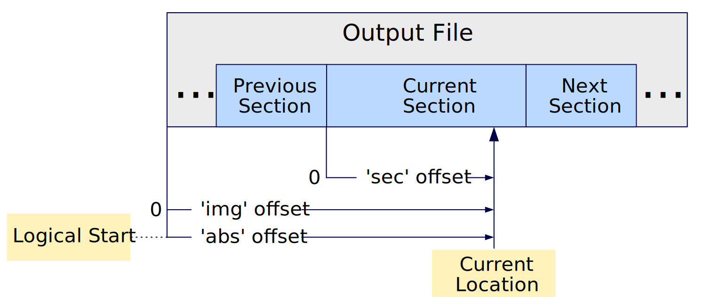

# Brink

Brink is a domain specific language for linking and composing of an output file.
Brink simplifies construction of complex files by managing sizes, offsets and
ordering in a readable declarative style.  Brink was created with FLASH or other
NVM images in mind, especially for use in embedded systems.

## Hello World

For a source file called hello.brink:

    /*
     * A section defines part of an output.
     */
    section foo {
        // Print a quoted string to the console
        print "Hello World!\n";
    }

    // An output statement outputs the section to a file
    output foo;

Running the command:

    $ brink hello.brink

Produces `Hello World!` to the console.  Brink also produced an empty file called `output.bin`.  This file is the default output when you don't specify some other name on the command line with the `-o` option.  Why is the file empty?  Because nothing in our program produced output file content -- we just printed the console message.

Let's fix that.  We can replace the `print` command with the `wrs` command, which is shorthand for 'write string':

    /*
     * A section defines part of an output.
     */
    section foo {
        // Write a quoted string to the output
        wrs "Hello World!\n";
    }

    // An output statement outputs the section to a file
    output foo;

Now, running the command again:
    
    $ brink hello.brink
    
Produces output.bin containing the string `Hello World!\n`.

## Assertions

Brink supports assert expressions for error checking.  This example verifies that the size of the section 'bar' is 13 bytes long.

    section bar {
        wrs "Hello World!\n";
        assert sizeof(bar) == 13;
    }
    output bar;

To aid in debug, you can of course print this length information to the console during generation of your output:

    section bar {
        print "Output size is ", sizeof(bar), " bytes\n";
        wrs "Hello World!\n";
        assert sizeof(bar) == 13;
    }
    output bar;

Prints the console message:

    Output size is 13 bytes

In addition to writing to 'output.bin'.

## The Location Counter

Like the [GNU linker 'ld'](https://ftp.gnu.org/old-gnu/Manuals/ld-2.9.1/html_mono/ld.html), brink uses the concept of a *location counter*.  The location counter is the current position in the output file, referenced from either the start of the current section, the start of the entire output file (or image) or the absolute logical address.  The location counter can only move forward.

The following diagram shows the basic concepts.  Users specify the starting logical address using an [output](#output-section-identifier-absolute-starting-address) statement.

Programs can query the location counter using the [abs](#abs-identifier----u64), [img](#img-identifier----u64) and [sec](#sec-identifier----u64) statements.  Programs force the location counter forward to a specific offset or address using the [set_sec](#set_sec-expression--pad-byte-value), [set_img](#set_img-expression--pad-byte-value) and [set_abs](#set_abs-expression--pad-byte-value) statements.  Brink reports an error if any set operation would cause the location counter to move backwards.
## Unit Testing

Brink supports unit tests.

    cargo test

## Fuzz Testing

Brink supports fuzz tests for its various submodules.  Fuzz testing starts from
a corpus of random inputs and then further randomizes those inputs to try to
cause crashes and hangs.  At the time of writing (Rust 1.49.0), fuzz testing
**required the nightly build**.

To run fuzz tests:

    $ cd process
    $ cargo +nightly fuzz run fuzz_target_1

    $ cd lineardb
    $ cargo +nightly fuzz run fuzz_target_1

    $ cd ast
    $ cargo +nightly fuzz run fuzz_target_1

Fuzz tests run until stopped with Ctrl-C.  In my experience, fuzz tests will catch a problem in 60 seconds or not at all.

Cargo fuzz uses LLVM's libFuzzer internally, which provides a vast array of runtime options.  To see thh options using the nightly compiler build:

    cargo +nightly fuzz run fuzz_target_1 -- -help=1

A copy of this help output is in the fuzz_help.txt file.

For example, setting a smaller 5 second timeout for hangs and maximum input length of 256 bytes.

    cargo +nightly fuzz run fuzz_target_1 -- -timeout=5 -max_len=256

## Basic Structure of a Brink Program

A brink source file consists of one or more section definitions and exactly one output statement.    Each section has a unique name.  The output statement specifies the name of the top level section.  Starting from the top section, Brink recursively evaluates each section and produces the output file.  For example, we can define a section with a write-string (wrs) expression:

    section foo {
        wrs "I'm foo";
    }

    output foo;

Produces a default output named `output.bin`.

    $ cat output.bin
    I'm foo

Using a write (wr) statement, sections can write other sections:

    section foo {
        wrs "I'm foo\n";
    }

    section bar {
        wrs "I'm bar\n";
        wr foo;
    }

    output bar;

Produces `output.bin`:

    $ cat output.bin
    I'm bar
    I'm foo

---
## Brink Language Reference

---
## Comments

Brink supports C language line and block comments.

## Whitespace

Brink supports lenient C language style whitespace rules.

## Semicolon Termination

Like C language, statements must be terminated with a trailing semicolon character.

## Types

Brink supports the following data types:

* `U64` - 64-bit unsigned values
* `I64` - 64-bit signed values
* `Integer` - 64-bit with flexible sign treatment
* `QuotedString` - A UTF-8 string in double quotes
* `Identifier` - Identifier names

## Literals

### Number Literals

Brink supports number literals in decimal, hex (0x) and binary (0b) forms.  After the first digit, you can use '_' within number literals to help with readability.  Brink uses the [parse_int](https://crates.io/crates/parse_int) library for conversion from string to value.

    assert 42 == 42;
    assert -42 == -42;
    assert 0x42 == 0x42;
    assert 0x42 == 66;
    assert 0x4_2 == 66;
    assert 0x42 == 6_6;

    assert 0b0 == 0;
    assert 0b01000010 == 0x42;
    assert 0b0100_0010 == 0x42;
    assert 0b101000010 == 0x142;
    assert 0b0000000001000010 == 0x42;

The following table summarizes how Brink determines the type of number literals.

| Example | Type    | Description                                                        |
|---------|---------|--------------------------------------------------------------------|
| 4       | Integer | Simple decimal numbers are `Integer` type with flexible signedness |
| 4u      | U64     | Explicitly `U64`                                                   |
| 4i      | I64     | Explicitly `I64`                                                   |
| -4      | I64     | Negative numbers are `I64`                                         |
| 0x4     | U64     | Hex numbers are `U64` by default                                   |
| 0x4i    | I64     | Explicitly `I64` hex number                                        |
| 0b100   | U64     | Binary numbers are `U64` by default                                |

For convenience, the compiler casts the flexible `Integer` type to `U64` or `I64` as needed.

    assert 42u == 42;  // U64 operates with Integer
    assert 42i == 42;  // I64 operates with Integer

Otherwise the types used in an expression must match.  For example:

    assert 42u == 42i; // mix unsigned and signed

Produces an error message:

    error[EXEC_13]: Input operand types do not match.  Left is 'U64', right is 'I64'
      ┌─ tests/integers_5.brink:2:12
      │
    2 │     assert 42u == 42i; // mix unsigned and signed
      │            ^^^    ---

Users can explicitly cast a number literal or expression to the required signedness using the built-in `to_u64` to `to_i64` functions.  For example:

    assert -42 != to_i64(42);  // comparing signed to unsigned

The `to_u64` and `to_i64` functions **DO NOT** report an error if the runtime value under/overflows the destination type.

    assert 0xFFFF_FFFF_FFFF_FFFF == to_u64(-1); // OK
    assert to_i64(0xFFFF_FFFF_FFFF_FFFF) == -1; // OK

### True and False

Brink considers a zero value false and all non-zero values true.

### Quoted Strings

Brink allows utf-8 quoted strings with escape characters quote (\\\") tab (\t) and newline (\n).  Newlines are Linux style, so "A\n" is a two byte string on all platforms.

## Arithmetic Operators

Brink supports the following arithmetic operators with same relative precedence as the Rust language.

| Precedence | Operator | Under/Overflow Check? | Description                                   |
|------------|----------|-----------------------|-----------------------------------------------|
| Highest    | (   )    | n/a                   | Paren grouping                                |
|            | *   /    | yes                   | Multiply and divide                           |
|            | +   -    | yes                   | Add and subtract                              |
|            | &        | n/a                   | Bitwise-AND                                   |
|            | \|       | n/a                   | Bitwise-OR                                    |
|            | <<  >>   | no                    | Bitwise shift up and down                     |
|            | ==  !=   | n/a                   | Equals and non-equal                          |
|            | =>       | n/a                   | Greater-than-or-equal (same precedence as ==) |
|            | <=       | n/a                   | less-than-or-equalLTE (same precedence as ==) |
|            | &&       | n/a                   | Logical-AND                                   |
| Lowest     | \|\|     | n/a                   | Logical-OR                                    |
---

As shown in the table, Brink will check some operations for arithmetic under/overflow.

---

## `abs( [identifier] ) -> U64`

When called with an identifier, returns the absolute byte address of the identifier as a U64.  When called without an identifier, returns the current absolute address.  The absolute byte address is the image offset + the starting address specified in the `output` statement.

Example:

    section fiz {
        assert abs() == 0x1006;
        wrs "fiz";
        assert abs() == 0x1009;
        assert abs(foo) == 0x1000;
    }
    
    section bar {
        assert abs() == 0x1003;
        wrs "bar";
        assert abs() == 0x1006;
        wr fiz;
        assert abs() == 0x1009;
    }
    
    // top level section
    section foo {
        assert abs() == 0x1000;
        wrs "foo";
        assert abs() == 0x1003;
        assert abs(fiz) == 0x1006;
        wr bar;
        assert abs() == 0x1009;
        assert abs(bar) == 0x1003;
    }
    
    output foo 0x1000;  // starting absolute address is 0x1000

---

## `align <expression> [, <pad byte value>];`

The align statement writes pad bytes into the current section until the absolute location counter reaches the specified alignment.  Align writes 0 as the default pad byte value, but the user may optionally specify a different value.

Example:

    section foo {
        wrs "Hello";
        align 32;
        assert sizeof(foo) == 32;
        assert abs() == 32;
    }
    
    output foo;

---

## `assert <expression>;`

The assert statement reports an error if the specified expression does not evaluate to a true (non-zero) value.  Assert expressions provide a means of error checking and do not affect the output file.

Example:

    section foo {
        assert 1;   // OK, non-zero is true
        assert -1;  // OK, non-zero is true
        assert 1 + 1 == 2;
    }

    output foo;

---

## `img( [identifier] ) -> U64`

When called with an identifier, returns the byte offset as a U64 of the identifier from the start of the output image.  When called without an identifier, returns the current image offset.

Example:

    section fiz {
        assert img() == 6;
        wrs "fiz";
        assert img() == 9;
        assert img(foo) == 0;
    }
    
    section bar {
        assert img() == 3;
        wrs "bar";
        assert img() == 6;
        wr fiz;
        assert img() == 9;
    }
    
    // top level section
    section foo {
        assert img() == 0;
        wrs "foo";
        assert img() == 3;
        assert img(fiz) == 6;
        wr bar;
        assert img() == 9;
        assert img(bar) == 3;
    }
    
    output foo 0x1000;  // starting absolute address is 0x1000

---

## Labels
Labels assign an identifier to a specific location in the output file.  Other source code can then refer to the location of the label by name.  Labels have global scope and label names must be globally unique.  Multiple different labels can refer to the same location.

Labels have the form `<label identifier>:`

For example:

    section foo {
        // assign the label 'lab1' to the current location
        lab1: wrs "Wow!";
        // assign the label 'lab2' to the current location
        lab2:
        assert abs(lab1) == 0x1000;
        assert abs(lab2) == 0x1004;
        assert abs(lab3) == 0x1004;
        // yet another label, same location as 'lab2'
        lab3:
    }

    output foo 0x1000;
---

## `output <section identifier> [absolute starting address];`

An output statement specifies the top section to write to the output file and an optional absolute starting address.  Without a starting address, `output` defaults to a starting address of 0.

**A Brink program must have exactly one output statement.**

---
## `print <expression> [, <expression>, ...];`
The print statement evaluates the comma separated list of expressions and prints them to the console.  For expressions, print displays unsigned values in hex and signed values in decimal.  If needed, the `to_u64` and to `to_i64` functions can control the output style.

Writes the specified quoted string to the output.  Brink supports utf-8 quoted strings with escape characters

* quote (\\\")
* tab (\t)
* newline (\n)
* null (\0)

Newlines are Linux style, so "A\n" is a two byte string on all platforms.

Brink executes a given print statement for each instance found in the output file.  In other words, a print statement in a section written multiple times will execute multiple times in the order found.

Example:

    section bar {
        print "Section 'bar' starts at ", abs(), "\n";
        wrs "bar";
    }
    
    // top level section
    section foo {
        print "Output spans address range ", abs(foo), "-", abs(foo) + sizeof(foo),
              " (", to_i64(sizeof(foo)), " bytes)\n";
        wrs "foo";
        wr bar;
        wr bar;
        wr bar;
    }
    
    output foo 0x1000;  // starting absolute address is 0x1000

Will result in the following console output:

    Output spans address range 0x1000-0x100C (12 bytes)
    Section 'bar' starts at 0x1003
    Section 'bar' starts at 0x1006
    Section 'bar' starts at 0x1009

---

## `sec( [identifier] ) -> U64`

When called with an identifier, returns the byte offset as a U64 of the identifier from the start of the current section.  When called without an identifier, returns the current section offset.

Example:

    section fiz {
        assert sec() == 0;
        wrs "fiz";
        assert sec() == 3;
    }
    
    section bar {
        assert sec() == 0;
        wrs "bar";
        assert sec() == 3;
        wr fiz;
        assert sec() == 6;
        assert sec(fiz) == 3;
    }
    
    // top level section
    section foo {
        assert sec() == 0;
        wrs "foo";
        assert sec() == 3;
        wr bar;
        assert sec() == 9;
    }
    
    output foo 0x1000;  // starting absolute address is 0x1000

When a section offset specifies an identifier, the identifier must be in the scope of the current section.  For example:

    section fiz {
        wrs "fiz";
    }

    section bar {
        wr fiz;
        assert sec(fiz) == 0; // OK fiz in scope in section bar
    }

    section foo {
        wr bar;
        assert sec(bar) == 0; // OK, bar is local in this section
        assert sec(fiz) == 0; // ERROR, fiz is out of scope in section foo
    }

    output foo 0x1000;

---

## `set_sec <expression> [, <pad byte value>];`
## `set_img <expression> [, <pad byte value>];`
## `set_abs <expression> [, <pad byte value>];`

The set_sec, set_img and set_abs statements pad the output until the respective location counter reaches the specified value.  Users may specify an optional pad byte value or use the default value of 0.

These statements may be used to pad sections or images to the specified length.

| Statement | Description                                                  |
|-----------|--------------------------------------------------------------|
| set_sec   | Pads until the *section* offset reaches the specified value. |
| set_img   | Likewise for the *image* offset.                             |
| set_abs   | Likewise for the *absolute address*                          |

Note that these statements cannot cause the current location counter to move backwards.  If the specified value is less the corresponding location, brink reports an error.

Example:

    section foo {
        wr8 1;
        wr8 2;
        wr8 3;
        wr8 4;
        wr8 5;
        set_sec 16;
        assert abs() == 16;
        assert img() == 16;
        assert sec() == 16;
        wr8 0xAA, 3;
        set_sec 24, 0xFF;
        assert abs() == 24;
        assert img() == 24;
        assert sec() == 24;
        set_sec 24, 0xEE; // should do Nothing
        wr8 0xAA, 3;
        set_sec 27, 0x33; // should do nothing
        set_sec 28, 0x77; // should pad to 28
        assert sizeof(foo) == 28;
    }

    output foo;

---

## `sizeof( <identifier> ) -> U64`

Returns the size in bytes of the specified identifier.

Example:

    section empty_one {}
    section foo {
        wrs "Wow!";
        wr empty_one;
        assert sizeof(empty_one) == 0;
        assert sizeof(foo) == 4;
    }
    
    output foo;
---

## `to_i64( <expression> ) -> I64`

Converts the specified expression to the I64 type without regard to under/overflow.

Example:

    section foo {
        assert to_i64(0xFFFF_FFFF_FFFF_FFFF) == -1;
        assert to_i64(42u) == 42;
        assert to_i64(42u) == 42i;
        assert to_i64(42) == 42i;
    }

    output foo;

---

## `to_u64( <expression> ) -> U64`

Converts the specified expression to the U64 type without regard to under/overflow.

Example:

    section foo {
        assert 0xFFFF_FFFF_FFFF_FFFF == to_u64(-1);
        assert to_u64(42i) == 42;
        assert to_u64(42i) == 42u;
        assert to_u64(42) == 42u;
    }
    
    output foo;

---

## `wr8 <expression> [, <expression>];`
## `wr16 <expression> [, <expression>];`
## `wr24 <expression> [, <expression>];`
## `wr32 <expression> [, <expression>];`
## `wr40 <expression> [, <expression>];`
## `wr48 <expression> [, <expression>];`
## `wr56 <expression> [, <expression>];`
## `wr64 <expression> [, <expression>];`

Evaluates the first expression and writes the result as a little-endian binary value to the output file.  Upper bits of the result value are silently truncated to the specified bit length.  The optional second expression specifies the repetition count.

Example:

    // Test expressions in wrx
    section foo {
        wr8  (1 + 2) + img() + abs(foo) + sizeof(foo); // 3 + 0 + 10 + 36  = 49
        wr16 (1 + 2) + img() + abs(foo) + sizeof(foo); // 3 + 1 + 10 + 36  = 50 00
        wr24 (1 + 2) + img() + abs(foo) + sizeof(foo); // 3 + 3 + 10 + 36  = 52 00 00
        wr32 (1 + 2) + img() + abs(foo) + sizeof(foo); // 3 + 6 + 10 + 36  = 55 00 00 00
        wr40 (1 + 2) + img() + abs(foo) + sizeof(foo); // 3 + 10 + 10 + 36 = 59 00 00 00 00
        wr48 (1 + 2) + img() + abs(foo) + sizeof(foo); // 3 + 15 + 10 + 36 = 64 00 00 00 00 00
        wr56 (1 + 2) + img() + abs(foo) + sizeof(foo); // 3 + 21 + 10 + 36 = 70 00 00 00 00 00 00
        wr64 (1 + 2) + img() + abs(foo) + sizeof(foo); // 3 + 28 + 10 + 36 = 77 00 00 00 00 00 00 00
        assert sizeof(foo) == 36;
    }
    
    output foo 10;

Another example using the optional repetition expression.

    section foo {
        wr32 0x12345678, 10; // write 0x12345678 10 times to the output file.
        wr8 0, abs() % 4096; // write zero enough times to align to 4KB boundary.
    }

---

## `wrf "<quoted file path>";`

Write the file at the specified path into the output file.  Brink treats all input files as binary files.  Paths can be relative to the current directory or absolute.

For example, given the file test_source_1.txt containing:

    Hello!

The following program simply copies these 6 UTF-8 characters to the output file.

    section foo {
        wrf "test_source_1.txt"; // Hello!
        assert(sizeof(foo) == 6);
    }

    output foo;

---

## `wrs <expression> [, <expression>, ...];`

Evaluates the comma separated list of expressions and writes the resulting string to the output file.  Wrs accepts the same expressions and operates similarly to the print statement.  For more information, see [print](#print-expression--expression-).

The wrs statement does not write a terminating 0 byte after the string.  Users creating null terminated (C style) strings in an output file should add an explicit \0.

    wrs "my null terminated string\0";
